```{r libraries, results='hide', message = FALSE, echo = FALSE,  warning = FALSE}

#install.packages("tidyverse")
#install.packages("readxl")
#devtools::install_github("gadenbuie/xaringanExtra")
#install.packages("fontawesome")


library(dplyr)
library(leaflet)
library(readxl)
library(xaringanExtra)
library(fontawesome)
library(icons)
library(DT)
library(htmltools)
library(htmlwidgets)
library(kableExtra)
library(readr)

knitr::opts_chunk$set(message=FALSE, warning=FALSE, hiline=TRUE)

xaringanExtra::use_xaringan_extra(include = c("panelset", "tile_view", "share_again", "use_broadcast"))

xaringanExtra::style_share_again(share_buttons = c("twitter", "linkedin", "pocket"))


```


background-image: url(images/rabies_retreat.png)
background-position: top right
background-size: contain
class: middle, left

# `r rmarkdown::metadata$title`

## `r rmarkdown::metadata$author`

### `r rmarkdown::metadata$date`


.footnote[Map courtesy of the Friedrich Loeffler Institut]

---
class: middle, left
# About me

.pull-left[

.center[


### Dr. Laurie Baker

]]

.pull-right[

### `r icons::fontawesome("graduation-cap")` BSc Marine Biology, University of St. Andrews
### `r icons::fontawesome("graduation-cap")` Msc Marine Biology, Dalhousie University
### `r icons::fontawesome("graduation-cap")` PhD Epidemiology, University of Glasgow
]

.center[
[`r icons::fontawesome("link")` lauriebaker.rbind.io](https://lauriebaker.rbind.io)
[`r icons::fontawesome("twitter")` @llbaker1707](https://twitter.com/llbaker1707)
[`r icons::icon_style(icons::fontawesome("github"), scale = 1)` @laurielbaker](https://github.com/laurielbaker)
]

---
class: middle, left
# About me

.pull-left[

.center[


### Dr. Laurie Baker

]]

.pull-right[

### `r icons::fontawesome("syringe")`  Medical Research Council Fellow, University of Glasgow
### `r icons::fontawesome("desktop")` Data Science Lecturer, Data Science Campus, Office for National Statistics
### `r icons::fontawesome("desktop")` Visiting Assistant Professor, Digital and Computational Studies, Bates College
]

.center[
[`r icons::fontawesome("link")` lauriebaker.rbind.io](https://lauriebaker.rbind.io)
[`r icons::fontawesome("twitter")` @llbaker1707](https://twitter.com/llbaker1707)
[`r icons::icon_style(icons::fontawesome("github"), scale = 1)` @laurielbaker](https://github.com/laurielbaker)
]
???

---
class: middle, left, inverse
## Computer Science is a mode of expression and problem-solving that can be applied to problems we find interesting and issues we care about. 

---
# Outline

### 1. Introduce you to some questions I care about

--
### 2. Explore the intersection of human ecology and computer science in a case study: Fox rabies elimination in Western Europe
--

### 3. Discuss curriculum ideas to support you in applying computer science to issues you care about

---
class: middle, left
# Research Interests

.left-column[
.center[

]
]

.right-column[

.center[
## `r icons::fontawesome("satellite")` 
]
### Spatial and temporal patterns in human and biological systems

### - Disease spread
### - Animal movement
### - Fisheries management

]

---
class: middle, left
# Research Interests

.left-column[
.center[

]
]

.right-column[
.center[
## `r icons::fontawesome("satellite")` 
### Use of novel data sources to inform policy
]

### - Satellite imagery
### - Acoustic tags
### - GPS tracking


]

???

My work occurs at the intersection of Human Ecology, Math and Statistics, and Computer Science.

---
class: middle, left
# Research Interests

.left-column[
.center[

]
]

.right-column[
.center[
## `r icons::fontawesome("graduation-cap")`
]
### Broadening access to computer science education
### - Teaching inclusive and accessible design
### - Creating open-source education materials

]

???

My work occurs at the intersection of Human Ecology, Math and Statistics, and Computer Science.

---
# Target species in the Chilean longline fishery

.pull-left[

.center[

]

]

.pull-right[
## Topics
### `r icons::fontawesome("fish")`  **Ecology**
### `r icons::fontawesome("desktop")` **Spatial Statistics**
### `r icons::fontawesome("satellite")` **Novel Data Sources**

]

### `r icons::fontawesome("lightbulb")` What factors influence a fisher's target species (market value, weather, location, time of year) under different management practices?

???
I used catch composition and machine learning to infer a fisher's target species.

---
# Grey seals as bioprobes
.pull-left[

.center[

]

]

.pull-right[
## Topics

### `r icons::fontawesome("fish")`  **Ecology**
### `r icons::fontawesome("desktop")` **Spatial Statistics**
### `r icons::fontawesome("satellite")` **Novel Data Sources**
]

### `r icons::fontawesome("lightbulb")` What is the detection efficiency of acoustic tags in the field? What potential is there to use grey seals to sample the marine environment?

???


---
# Open-access interactive spatial data tutorials

.pull-left[

.center[
<iframe src="https://andysouth.shinyapps.io/intro-to-spatial-r/" width="700" height="416" frameBorder="0"></iframe>

]
]

.pull-right[
## Topics

### `r icons::fontawesome("desktop")` **Spatial Statistics**
### `r icons::fontawesome("satellite")` **Novel Data Sources**
### `r icons::fontawesome("desktop")` **Open-source education resources**

]

### `r icons::fontawesome("lightbulb")` Aim: to equip communities with the data science tools to address local issues

---
# Designing accessible programming lessons

.left-column[

<iframe src="https://mir-community.github.io/mir_accessibility_guidebook/MiR-Accessibility-Handbook.html" width="516" height="516" frameBorder="0"></iframe>

]

.right-column[

## Topics
### `r icons::fontawesome("universal-access")`  **Accessibility**
### `r icons::fontawesome("desktop")` **Open-source education resources**

]

???


---
# Spread and control of fox rabies in Europe

.pull-left[

.center[
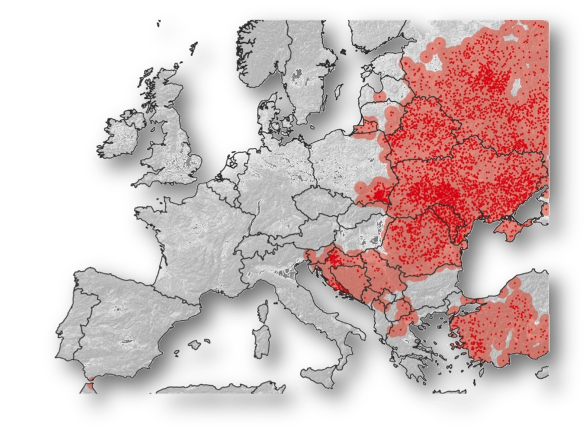
]
]

.pull-right[
## Topics

### `r icons::fontawesome("fish")`  **Ecology**
### `r icons::fontawesome("syringe")`  **Public Health**
### `r icons::fontawesome("desktop")` **Spatial Statistics**

]

### `r icons::fontawesome("lightbulb")` What can we learn about vaccination planning from the successful elimination of rabies in Western Europe?

---
class: inverse, center, middle
# Vaccination Planning in the Wild
 
???

The first example is an example of wildlife vaccination planning. 


---
# Background

### - Only two diseases have been eliminated worldwide: small pox and rinderpest.

```{r, echo=FALSE, out.width=1050, fig.align='center', fig.cap="Two pictures: one of patient's leg with small pox and the other of cattle that have died from rinderpest"}

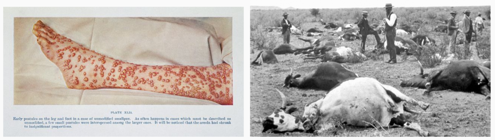

```

### - Mass vaccination can reduce the burden of diseases.

???
- Only two infectious diseases have been eliminated worldwide: small pox and rinderpest.

- Mass vaccination can greatly reduce the burden of vaccine-preventable diseases. 

- However, it is unclear how long vaccination programs must operate to eliminate infection. 

- In this talk I am going to explore two different vaccination strategies applied to fox rabies

---
# Process of elimination

### - How long control programs must run is unclear.

```{r, echo=FALSE, out.width=1090, fig.align='center', fig.cap="The stages of elimination"}

knitr::include_graphics("images/elimination_phases_klepac.PNG")

```

.foot_note[
Stages toward and after elimination in a given location and milestones on the path to elimination. Shading illustrates control intensity (darker grey for heightened efforts). *Klepac et al. 2013. Towards the endgame and beyond. Phil Trans B.* ]

???

* Greater effort is often required to eliminate the disease than control the disease.
* In the end stages, the disease becomes more difficult to detect, and low case numbers mean that a disease drops in priority.
* The successful elimination of rabies from Western Europe presents a unique opportunity to study disease persistence and explore the timing of vaccination control strategies. 

---
# Rabies
### An RNA virus that causes encephalitis in a large range of mammals.
--

### Deadly disease (>99% fatal) that kills over 59,000 people each year.
--

```{r, echo=FALSE, out.width=750, fig.align='center', fig.cap="Rabies disease cycle in foxes."}

knitr::include_graphics("images/fox_rabies_timeline.png")

```


---
# Vaccine Deployment
.left-column[
```{r, echo=FALSE, out.height=490, out.width = 500, fig.align='center', fig.cap="Animation showing rabies cases and the historical distribution of vaccines. Image credit: Friedrich Loeffler Institute"}
knitr::include_graphics("images/rabies_cases_vaccinations_snapshot.PNG")
```

.footnote[<span style="color: blue;">Blue polygons:</span> vaccination campaigns; <span style="color: red;">Red dots:</span> reported rabies cases]

]

.right-column[

```{r, echo=FALSE, out.width=220, fig.align='center', fig.cap="Image 1. Vaccine-loaded chicken heads. Image 2. Fixed wing aircraft used to distribute vaccines."}
knitr::include_graphics(c("images/fixed_wing_hungary.jpg", "images/chicken_head.jpg"))
```


`r icons::fontawesome("syringe")` At least they didn't go with the spring-loaded needle traps! ~ [*"Article in the Atlantic by Ed Yong*](https://www.theatlantic.com/science/archive/2015/12/that-time-europe-air-dropped-vaccine-loaded-chicken-heads-to-bait-rabid-foxes/417951/) by Ed Yong

]


???

Over three decades, vaccine loaded chicken-heads were air-dropped across Europe covering a total of 2.36 million square kilometers, the equivalent of 550,000 soccer fields. 

---
# Vaccine Deployment

.left-column[
```{r, echo=FALSE, out.height=490, out.width = 660, fig.align='center', fig.cap="Animation showing rabies cases and the historical distribution of vaccines. Image credit: Friedrich Loeffler Institute"}
knitr::include_graphics("images/western_europe_vac_cases_oct_2016.gif")
```

.footnote[<span style="color: blue;">Blue polygons:</span> vaccination campaigns; <span style="color: red;">Red dots:</span> reported rabies cases]

]

.right-column[
.center[

#### `r icons::icon_style(icons::fontawesome("shield-virus"), scale = 2)`

### Over 30 years, vaccinated 2.36 million square km (330,000 football fields)

#### `r icons::icon_style(icons::fontawesome("globe"), scale = 2)`

### Rabies eliminated from 9 countries in W. Europe

]
]

---
class: middle
# Project Aims

.center[
### `r icons::icon_style(icons::fontawesome("viruses"), scale = 2)`

## 1. Capture rabies spread and control and estimate key epidemiological parameters

### `r icons::icon_style(icons::fontawesome("globe"), scale = 2)`


## 2. Use the model to design **optimal** vaccination strategies and explore "what if" policy scenarios 

]
---
# 1: Fit a model to data to capture rabies dynamics

### `r icons::icon_style(icons::fontawesome("firefox-browser"), scale = 2)` Fox ecology: spring birth pulse, death

--

### `r icons::icon_style(icons::fontawesome("viruses"), scale = 2)` Disease Ecology: infection, migration between regions

--

### `r icons::icon_style(icons::fontawesome("shield-virus"), scale = 2)` Vaccination: vaccination events (where and when)
--

* Ask me more!

???
Births `r icons::icon_style(icons::fontawesome("arrow-up"), scale = 2)`
Deaths `r icons::icon_style(icons::fontawesome("arrow-down"), scale = 2)` Susceptible population

: infection rate, `r icons::icon_style(icons::fontawesome("arrow-up"), scale = 2)`
Migrating infectious individuals

 `r icons::icon_style(icons::fontawesome("arrow-down"), scale = 2)` Susceptible population
 
 
Infected individuals:
`r icons::icon_style(icons::fontawesome("arrow-up"), scale = 2)` Migrating infected foxes
 
### This part took 2.5 years! Ask me at the end of the talk or during the visit for more details.

 
---
## 2. Explore vaccination planning for different rabies scenarios

.left-column[
```{r, echo=FALSE, out.width=700, fig.align='center', fig.cap="Map showing the rabies retreat from Western Europe."}
knitr::include_graphics("images/rabies_retreat_endemic.png")
```
]

.right-column[

### 1. Endemic

]

---
## 2. Explore vaccination planning for different rabies scenarios

.left-column[
```{r, echo=FALSE, out.width=700, fig.align='center', fig.cap="Map showing the rabies retreat from Western Europe. Black box indicating high-risk areas."}
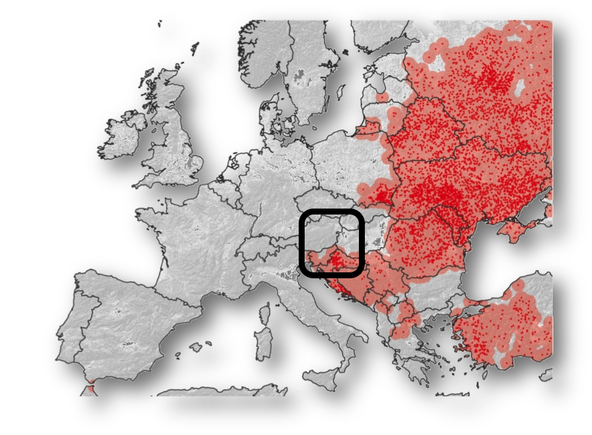
```
]

.right-column[

### 1. Endemic

### 2. High-risk

]

---
## 2. Explore vaccination planning for different rabies scenarios

.left-column[
```{r, echo=FALSE, out.width=700, fig.align='center', fig.cap="Map showing the rabies retreat from Western Europe. Black box indicating high-risk areas."}
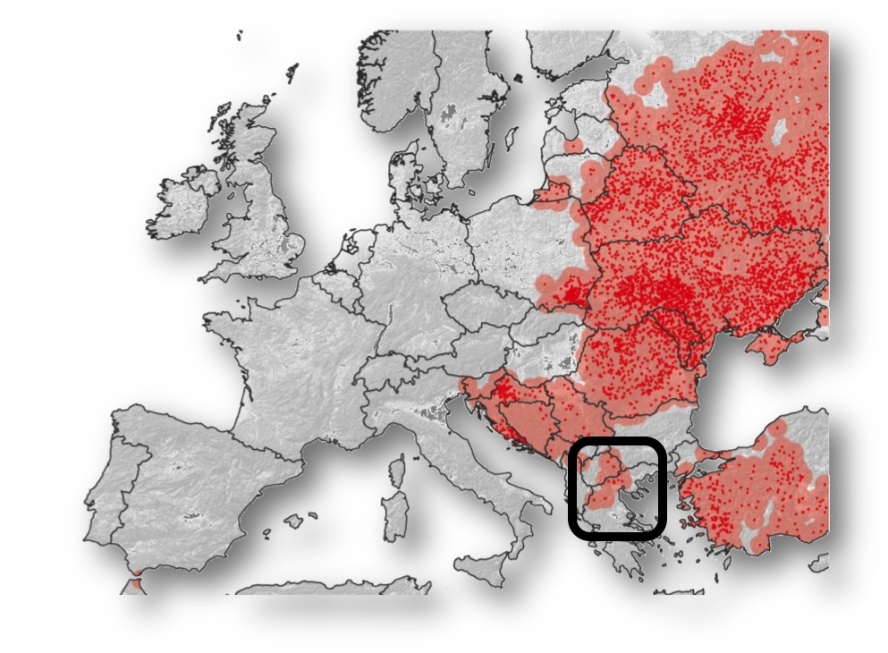
```
]

.right-column[

### 1. Endemic

### 2. High-risk

### 3. Endgame

]

---
# Study

.left-column[
```{r, echo=FALSE, out.width=470, fig.align='center', fig.cap="Map showing different rabies scenarios: endemic (all 5 regions); high-risk (3 regions infected); end game (1 region infected)."}

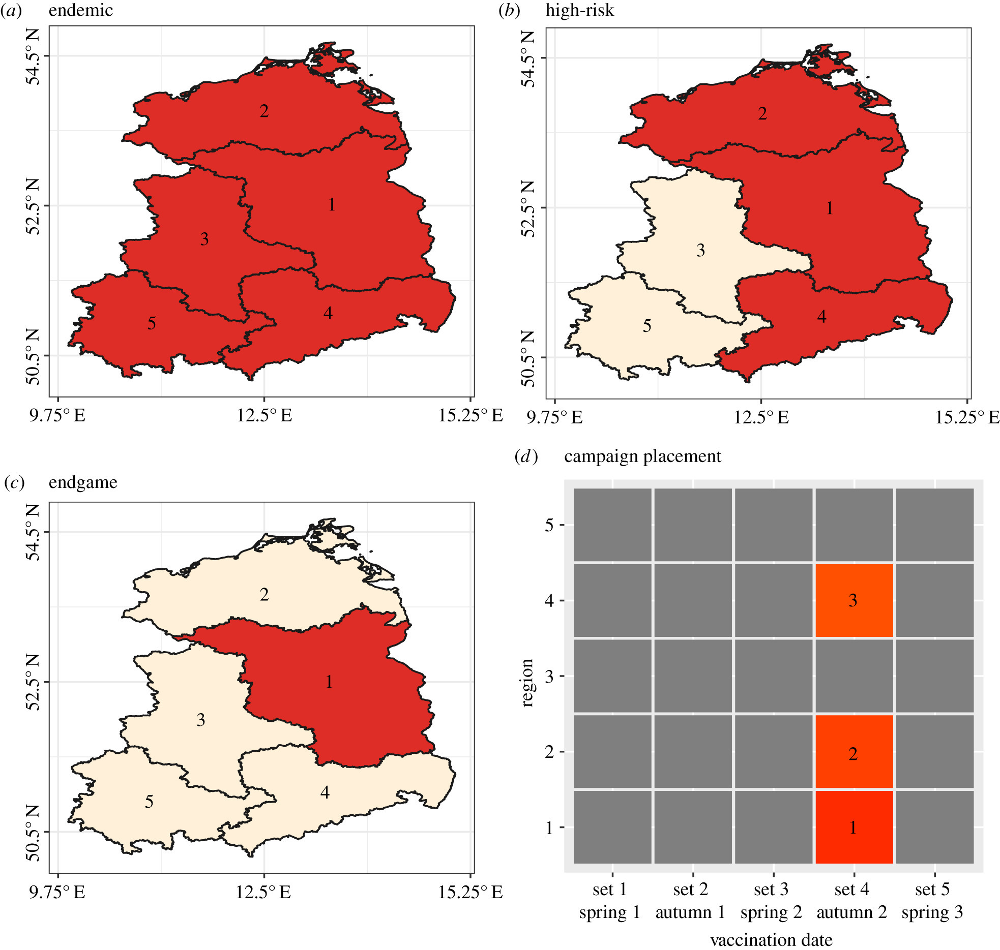


```
]

.right-column[

.center[

`r icons::icon_style(icons::fontawesome("globe"), scale = 2)`

### Where and When?


`r icons::icon_style(icons::fontawesome("clock"), scale = 2)`

### How many to achieve elimination?

]
]

.footnote[
[**Baker LL**, Matthiopoulos J, Müller T, Freuling C, Hampson K (2019). Optimizing
spatial and seasonal deployment of vaccination campaigns to eliminate wildlife
rabies. **Phil. Trans. R. Soc. B.** 374.](https://royalsocietypublishing.org/doi/10.1098/rstb.2018.0280)]

---
# Study

.left-column[
```{r, echo=FALSE, out.width=470, fig.align='center', fig.cap="Time series showing the impact of vaccination on rabies incidence."}


```
]

.right-column[

.center[

.left-column[

### The model in pseudo-code

`for(t in 1:endTime){

    for(r in 1:numRegions){
    
        populationSim()
        vaccinationSim()
        migrationSim()
        infectionSim()
      
    }
}`

]
]
]

.footnote[
[**Baker LL**, Matthiopoulos J, Müller T, Freuling C, Hampson K (2019). Optimizing
spatial and seasonal deployment of vaccination campaigns to eliminate wildlife
rabies. **Phil. Trans. R. Soc. B.** 374.](https://royalsocietypublishing.org/doi/10.1098/rstb.2018.0280)]

---
# Endemic

.left-column-big[
```{r, echo=FALSE, out.width=750, fig.align='center', fig.cap="Endemic (rabies in all 5 regions)."}

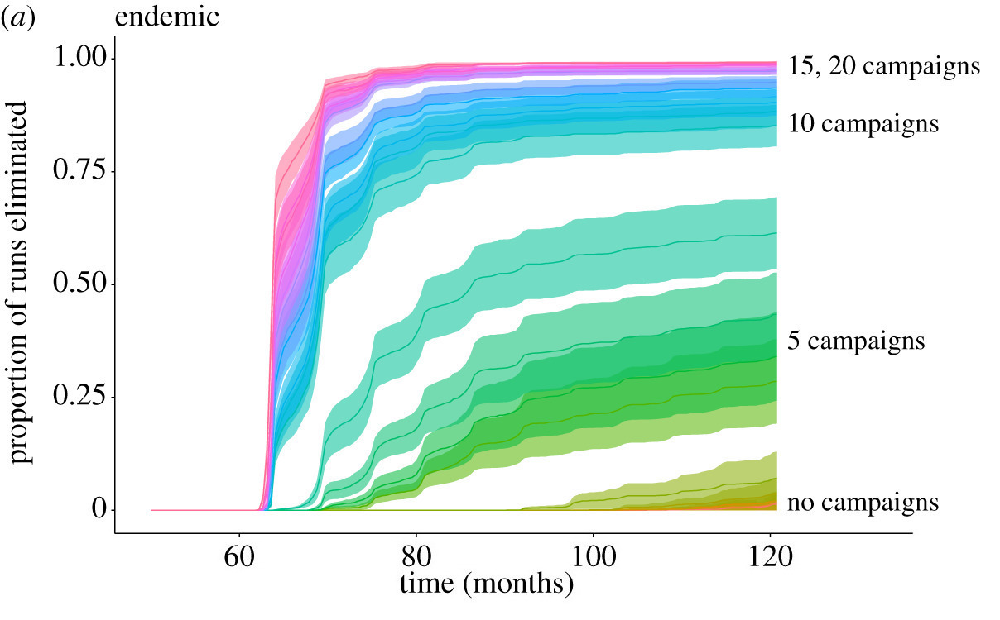

```
]

.right-column-small[
```{r, echo=FALSE, out.width=200, fig.align='center', fig.cap="Endemic (rabies in all 5 regions)."}

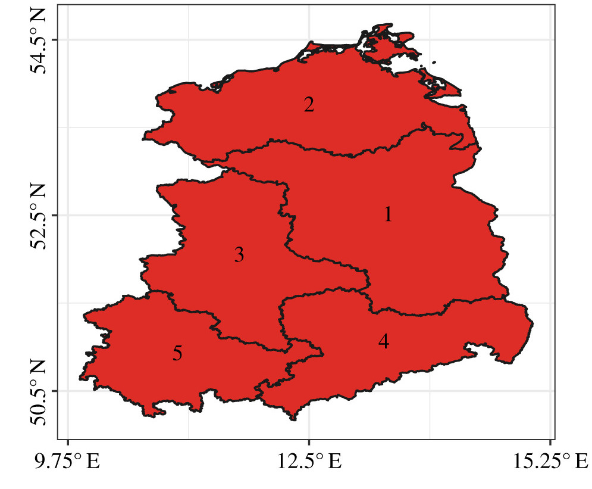

```

#### `r icons::icon_style(icons::fontawesome("clock"), scale = 2)` Coordinated and consecutive campaigns and autumn campaigns (after birth-pulse) = greatest reductions


]

---
# Endemic: Time to elimination


```{r, echo=FALSE, out.width=880, fig.align='center', fig.cap="Endemic (incidence ratio)."}

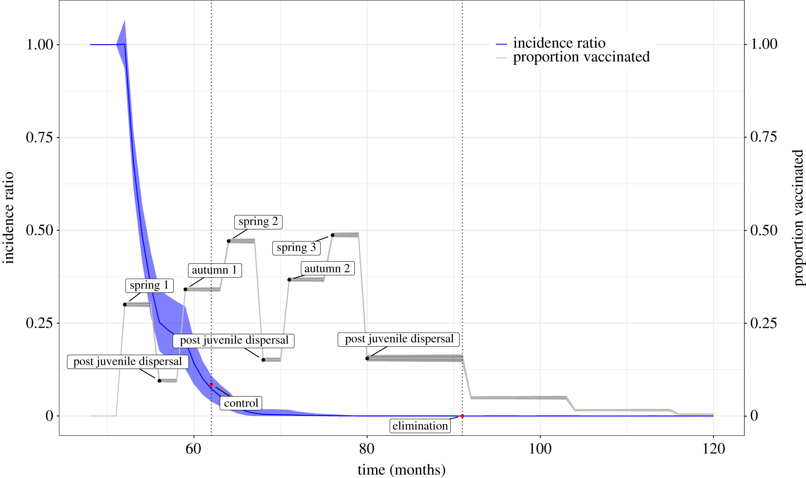

```

---
# High-risk

.left-column-big[

```{r, echo=FALSE, out.width=750, fig.align='center', fig.cap="Endemic (rabies in all 5 regions)."}

knitr::include_graphics("images/high_risk.jpeg")

```

]
.right-column-small[

```{r, echo=FALSE, out.width=200, fig.align='center', fig.cap="Endemic (rabies in all 5 regions)."}

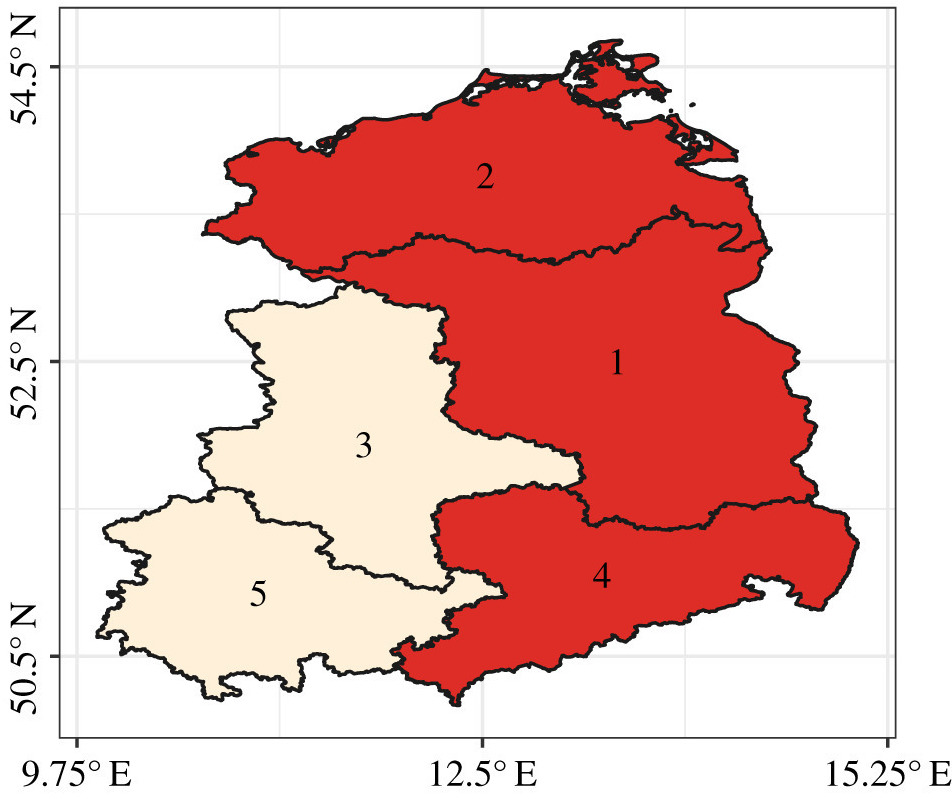

```

### Similar effort in high-risk and endemic 


]

---
# Endgame

.left-column-big[

```{r, echo=FALSE, out.width=750, fig.align='center', fig.cap="Endemic (rabies in all 5 regions)."}

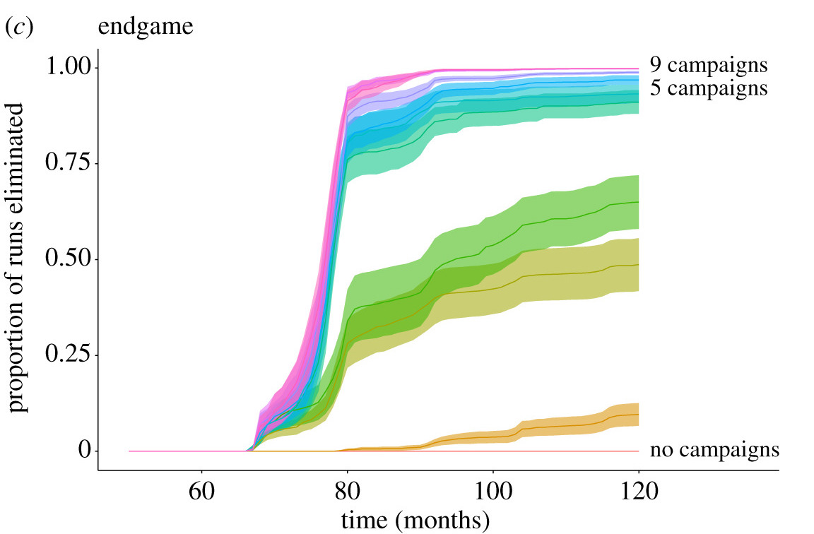

```

]
.right-column-small[

```{r, echo=FALSE, out.width=200, fig.align='center', fig.cap="Endemic (rabies in all 5 regions)."}

knitr::include_graphics("images/end_game.jpeg")

```

### Autumn vaccination campaigns in rabies-free regions required

]


???

This figure shows the probability of elimination and ranked importance of campaigns across epidemiological scenarios. Left panels show the probability of elimination from all five regions in response to incremental vaccination (mean, and shaded 95% CI). (a) In the endemic scenario, 21 campaigns were required to eliminate rabies from all regions. (b) In the high-risk scenario, 19 campaigns were required to eliminate rabies from all regions, with vaccination of the endemic regions ranked first, and vaccination after the birth pulse (months 56 and 68) contributing most to the probability of elimination. A minimum of two or three campaigns was required in neighbouring rabies-free regions. (c) In the endgame scenario, nine campaigns were required to eliminate rabies from all regions.


What we can see from these results is that:

1. Similar effort is required in high-risk and endemic, even though fewer regions were initially infected. 


2. Autumn campaigns were ranked highest and resulted in the greatest reductions in rabies because they come after the birth pulse. 

3. Vaccination needed in rabies-free regions. Because rabies moves across borders, vaccination is still required in neighbouring regions. 

---
class: center
# Take Home:

.center[
`r icons::icon_style(icons::fontawesome("hands-helping"), scale = 2)`

### 1. Coordinated and sustained effort required to control and eliminate rabies
]


--

`r icons::icon_style(icons::fontawesome("paw"), scale = 2)`

.center[
### 2. Understanding species ecology is important
]

--

`r icons::icon_style(icons::fontawesome("desktop"), scale = 2)`

.center[
### 3. Computer science can help us explore "what if" scenarios
]

---
class: inverse, center, middle
# Computer Science Curriculum Ideas
 
???

Now I want to switch gears to talk about the computer science curriculum I would hope to build at College of the Atlantic. 


---
class: center
# Design a curriculum that centers 

`r icons::icon_style(icons::fontawesome("lightbulb", style = "solid"), scale = 2)`
### Ethics of inquiry

--

`r icons::icon_style(icons::fontawesome("globe"), scale = 2)`
### Actionable positive change

--

`r icons::icon_style(icons::fontawesome("users"), scale = 2)`
### Accessible and inclusive design


???
With the freedom to work on and choose project and questions that are meaningful to you.

---
class: center
# Curriculum objectives

`r icons::icon_style(icons::fontawesome("tools", style = "solid"), scale = 2)` 
### Develop skills in algorithmic thinking and creative expression

--

`r icons::icon_style(icons::fontawesome("users", style = "solid"), scale = 2)` 
### Work with and engage with communities across Maine and worldwide

--

`r icons::icon_style(icons::fontawesome("hands-helping", style = "solid"), scale = 2)` 
### Apply computer science to local and global issues you care about


???

- I'm excited about the opportunity at College of the Atlantic to 
  - Help you to build your computer science toolset
  - support you in applying these tools to issues you care about.
  - work and engage with communities across Maine.
- I look forward to hearing after this talk about the questions that you are excited about exploring.
---
class: inverse, center, middle
# Examples from past students

---
# Factors influencing exoplanet discovery

<iframe src="https://dcs-210.github.io/project-matt-annie-ethan/presentation/img/Ethan5.gif" width="1016" height="516" frameBorder="0"></iframe>

Credit: 
---
# Trends in superbowl ad themes


<iframe src="https://dcs-210.github.io/project-lizakemuntopatrick/presentation/presentation.html#15" width="1016" height="516" frameBorder="0"></iframe>

???


Computer science and data science can provide us with the tools to tackle complex issues. But we bring the knowledge, the context, and importantly the human experience and perspectives to make our work meaningful and equitable. 

Data is always a simplification of the human experience and it is important that in our data science projects we ask the questions like those set out by Catherine D'Ingazio and Lauren Klein: "Data Science By Whom"? "Data Science For Whom?"?, "Data Science with whose interests in mind?" 

We also need to value local knowledge and support communities in finding their own solutions to questions. 

---
# Demographic trends in the needle trades in New England between 1790 and 1850

.left-col[
```{r, echo=FALSE, out.width=700, fig.align='center', fig.cap="Newspaper ad for a dress-maker"}


```
]

.right-col[

```{r, echo=FALSE}

seamstresses <- read_csv("../data/seamstress.csv")

seamstresses %>%
  kable() %>% 
  kable_styling(bootstrap_options = c("striped", "hover", "condensed")) %>% 
  scroll_box(width = "600px", height = "400px")
```


]

???

At Bates, I am currently working with students on a number of topics. Drawing on a collection of over 100 historical advertisements compiled during my time as an intern at Old Sturbridge Village, this presentation will explore demographic trends among women professionals in the needle trades in New England between 1790 and 1850. Through statistical analysis and data visualization in R, I will present a picture of women’s roles in the fashion industry in this particular place and time, and discuss the impact of these findings on how we view women professionals and clothing in the past. 


---
# Course ideas

.left-column[

```{r, echo=FALSE, out.width=520, fig.align='center', fig.cap="Class field trip to Dan Mills Studio in Lewiston"}

knitr::include_graphics("images/field_trip2.jpg")

```
Class field trip to Dan Mills Studio in Lewiston

]

.right-column[
### Data Visualization

]

---
# Course ideas

.left-column[

```{r, echo=FALSE, out.width=450, fig.align='center', fig.cap="The first yarn product of SkyKnit, by the Ravelry user citikas (Ravelry / citikas). Source: https://www.theatlantic.com/technology/archive/2018/03/the-making-of-skyknit-an-ai-yarn/554894/"}


```

### Patterns generated using AI

#### row 1: sl1, kfb, k1 (4 sts) <br>

#### row 2: sl1, kfb, k to end of row (5 sts)

]

.right-column[

### Data Visualization
### Knitting to coding


]

---
# Course ideas

.left-column[

```{r, echo=FALSE, out.width=440, fig.align='center', fig.cap=""}


```
#### Lyme Disease Risk and Reporting

.footnote[]
]

.right-column[

### Data Visualization
### Knitting to coding
### Community-engaged data science

]

---
# Course ideas

.left-column[

```{r, echo=FALSE, out.width=500, fig.align='center', fig.cap="Two people taking a picture of a heron"}

knitr::include_graphics("images/heron_monitoring.jpg")

```
#### Citizen scientists spotting a heron in Maine
.footnote[Image credit: https://www1.maine.gov/wordpress/ifwheron/]
]

.right-column[

### Data Visualization across mediums
### Knitting to coding
### Community-engaged data science
### Citizen science and data activism

]

---
class: middle, center
# Conclusion


`r icons::icon_style(icons::fontawesome("paint-brush", style = "solid"), scale = 2)` 

## Computer Science is a mode of expression and problem-solving. 

`r icons::icon_style(icons::fontawesome("tools", style = "solid"), scale = 2)` 

## I am excited about the prospect of helping you apply these tools to problems you find interesting and issues you care about. 

---
# Thank You!

.left-column[
```{r, echo=FALSE, out.width=400, fig.align='center', fig.cap="PhD Celebration Cake with fox and chicken heads on it"}

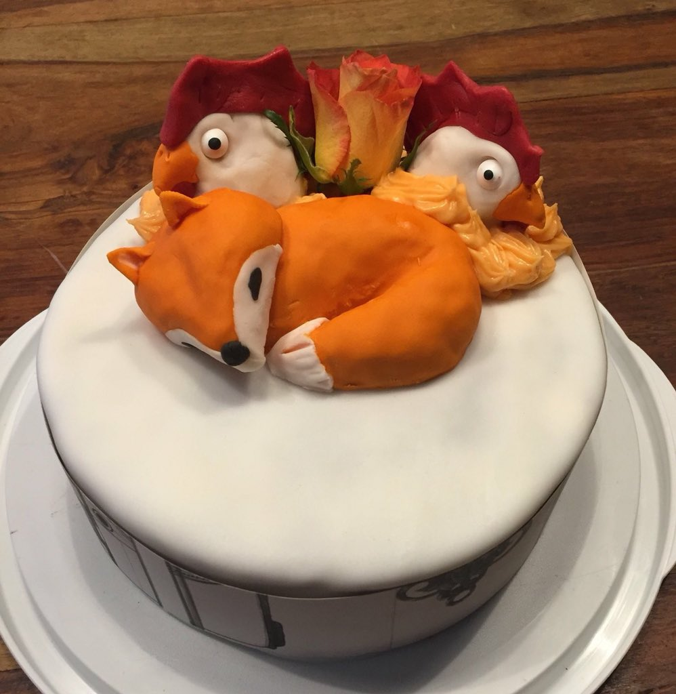

```


Slides created via the R package [**xaringan**](https://github.com/yihui/xaringan).

The chakra comes from [remark.js](https://remarkjs.com), [**knitr**](http://yihui.name/knitr), and [R Markdown](https://rmarkdown.rstudio.com).
]

.right-column[

**University of Glasgow**: 

Prof. Katie Hampson; 
Micaela De la Puente León;
Prof. Jason Matthiopoulos

**Friedrich Loeffler Institut**: 

Dr. Thomas Müller; Dr. Conrad Freuling; Patrick Wysocki

**Afrimapr**: 

Dr. Andy South (LSTM); Dr. Ahmadou Dicko (FAO, Senegal); Shelmith Kariuki (Nairobi, Kenya); Anelda Van der Walt (Talarify)

**FCDO & ONS, UK**:  
Dr. Joseph Crispell; Nathan Begbie; Saliha Minhas; Jonathon Mellor; Richard Leyshon

]

---
class: inverse, center, middle
# Additional slides

???

Some additional slides on impact of missing campaigns.

---
class: inverse, center, middle
# Rabies

???

Some additional slides on impact of missing campaigns.

---
# Spread of Rabies in Foxes

.left-column[
```{r, echo=FALSE, out.width=850, fig.align='center', fig.cap="The spread of rabies in foxes across Europe."}

knitr::include_graphics("images/rabies_spread.png")

```


.footnote[Figure courtesy of the Friedrich Loeffler Institut]

]
.right-column[


]

* **1940s:** Spillover from dogs to foxes

--

* **1950s-1970s:** Rapid spread throughout Europe

--

* **Late 1970s:** Veterinarians facing major health crisis

--

`r icons::fontawesome("pizza-slice")` Lunch Warning: Next Slide


---
# Impact of Missing Campaigns

.left-column[

```{r, echo=FALSE, out.width=750, fig.align='center', fig.cap="Time to elimination for different scenarios where campaigns were missed."}

knitr::include_graphics("images/rabies_presence.jpg")


```

]

.right-column[

.center[
`r icons::icon_style(icons::fontawesome("clock"), scale = 2)`

### Delay elimination


`r icons::icon_style(icons::fontawesome("money-bill-alt"), scale = 2)`


### Same or more effort required to achieve elimination

`r icons::icon_style(icons::fontawesome("baby"), scale = 2)`

### Consecutive and autumn campaigns most important

]
]


???

I also looked at what happens when things go wrong and we miss campaigns.

* We found that consecutive and coordinated vaccination across geographical regions is required to rapidly control and eliminate rabies

* Incomplete vaccination (missing campaign sets) compromised time to elimination, with the same or more effort required to achieve elimination and meet similar timelines. 

- It is, therefore, important that policymakers commit to the full elimination timeline and strive to maintain comprehensive coverage to eliminate persistent foci and prevent further costs.


---
# Foxes

* Most widespread terrestrial carnivore in Europe

* Territorial with high population turnover 
  * Most foxes live up to 4 years. 
  * Large birth pulse in spring where the population doubles. 


```{r, echo=FALSE, out.width=750, fig.align='center', fig.cap="Rabies disease cycle in foxes."}

knitr::include_graphics("images/fox_rabies_timeline.png")

```

.footnote[Figure courtesy of the Friedrich Loeffler Institut]
???

* Most widespread terrestrial carnivore in Europe
* Territorial with high population turnover 
  * Most foxes live on average 4 years. 
  * Large birth pulse in Spring where the population doubles. 


---
# Rabies

* Rabies is a deadly disease that kills over 59,000 people each year.
* An RNA virus that causes encephalitis in a large range of mammals.

```{r, echo=FALSE, out.width=750, fig.align='center', fig.cap="Map of the world with main rabies animal hosts pictured."}

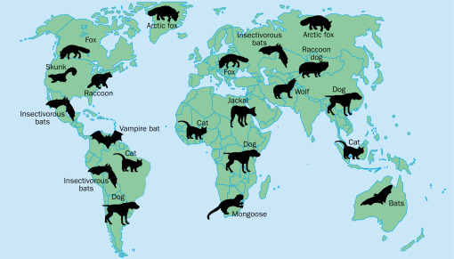

```

.footnote[Rupprecht CE, Hanlon CA, Hemachudha T. Rabies re-examined. Lancet Infect Dis. 2002 Jun;2(6):327-43. doi: 10.1016/s1473-3099(02)00287-6. PMID: 12144896.]

???

* Rabies is a deadly disease that kills over 59,000 people each year, with many millions more requiring expensive life-saving vaccines.
* Rabies is an RNA lyssavirus that causes encephalitis in a large range of mammals. 
* This map shows the primary reservoirs (that is the hosts that perpetuate this disease).
* The main reservoir in Europe is the red fox.

---
# Vaccine Deployment
AKA ["That Time Europe Air-dropped Vaccine-loaded Chicken Heads to Bait Rabid Foxes"](https://www.theatlantic.com/science/archive/2015/12/that-time-europe-air-dropped-vaccine-loaded-chicken-heads-to-bait-rabid-foxes/417951/)


.left-column[

<br>

```{r, echo=FALSE, out.width=420, fig.align='center', fig.cap="Image 2. Fixed wing aircraft used to distribute vaccines."}

knitr::include_graphics("images/fixed_wing_hungary.jpg")


```
.footnote[Images: Friedrich Loeffler Institut]
]

.right-column[

<br>


```{r, echo=FALSE, out.width=520, fig.align='center', fig.cap="Image 1. Vaccine-loaded chicken heads."}

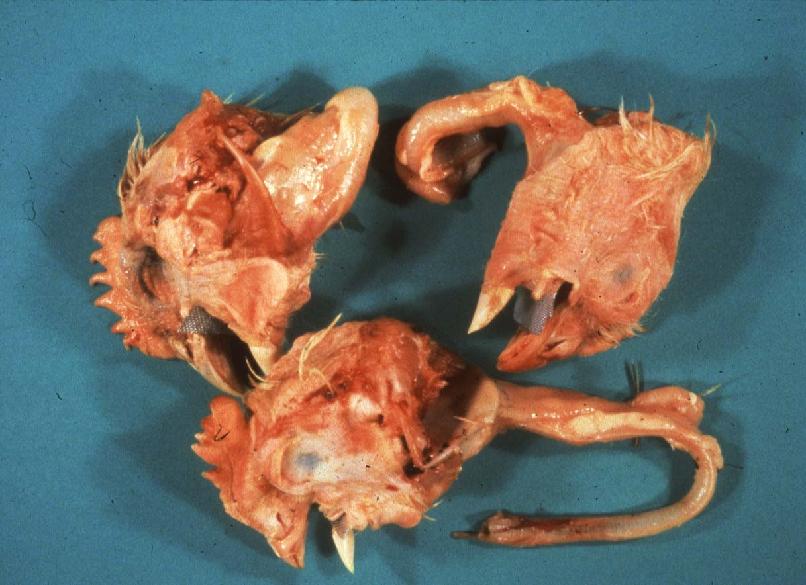


```

]

`r icons::fontawesome("syringe")` At least they didn't go with the spring-loaded needle traps!

---
class: inverse, center, middle
# Curriculum

???

Some additional slides on impact of missing campaigns.


---
# Explore questions you care about

.left-column[
.center[

]
]

.right-column[
## Contextual Knowledge

## Technical Skills

## Research Methods

## Collaboration Skills

## Professional Skills
]

---
# Curriculum at College of the Atlantic

.left-column[
## Contextual Knowledge

]

.right-column[
### - Positionality
### - Social and Environmental Justice
### - Domain knowledge
### - Data Ethics
]

---
# Computer Science Curriculum

.left-column[
## Contextual Knowledge

## Technical Skills

]

.right-column[
### - Programming languages
### - Data visualization
### - Version control
### - Data science libraries
### - Coding standards and practices
]

---
# Computer Science Curriculum

.left-column[
## Contextual Knowledge

## Technical Skills

## Research Methods

]

.right-column[
### - Qualitative Research
### - Quantitative Research
### - Experimental Design
### - Reproducibility
]

---
# Computer Science Curriculum

.left-column[
## Contextual Knowledge

## Technical Skills

## Research Methods

## Collaboration Skills

]

.right-column[
### - Teamwork
### - Communication
### - Stakeholder Engagement
]

---
# Computer Science Curriculum

.left-column[
## Contextual Knowledge

## Technical Skills

## Research Methods

## Collaboration Skills

## Professional Skills

]

.right-column[
### - Project Management
### - Professional Experience
### - Networking
]
