```{r libraries, results='hide', message = FALSE, echo = FALSE,  warning = FALSE}

#install.packages("tidyverse")
#install.packages("readxl")
#devtools::install_github("gadenbuie/xaringanExtra")
#install.packages("fontawesome")


library(dplyr)
library(leaflet)
library(readxl)
library(xaringanExtra)
library(fontawesome)
library(icons)
library(DT)
library(htmltools)
library(htmlwidgets)
library(kableExtra)
library(readr)

knitr::opts_chunk$set(message=FALSE, warning=FALSE, hiline=TRUE)

xaringanExtra::use_xaringan_extra(include = c("panelset", "tile_view", "share_again", "use_broadcast"))

xaringanExtra::style_share_again(share_buttons = c("twitter", "linkedin", "pocket"))


```


background-image: url(images/rabies_retreat.png)
background-position: top right
background-size: contain
class: middle, left

# `r rmarkdown::metadata$title`

## `r rmarkdown::metadata$author`

### `r rmarkdown::metadata$date`


.footnote[Map courtesy of the Friedrich Loeffler Institut]

---
class: middle, left
# About me

.pull-left[

.center[


### Dr. Laurie Baker

]]

.pull-right[

### `r icons::fontawesome("graduation-cap")` BSc Marine Biology, University of St. Andrews
### `r icons::fontawesome("graduation-cap")` Msc Marine Biology, Dalhousie University
### `r icons::fontawesome("graduation-cap")` PhD Ecology and Evolution, University of Glasgow
]

.center[
[`r icons::fontawesome("link")` lauriebaker.rbind.io](https://lauriebaker.rbind.io)
[`r icons::fontawesome("twitter")` @llbaker1707](https://twitter.com/llbaker1707)
[`r icons::icon_style(icons::fontawesome("github"), scale = 1)` @laurielbaker](https://github.com/laurielbaker)
]

---
class: middle, left
# About me

.pull-left[

.center[


### Dr. Laurie Baker

]]

.pull-right[

#### `r icons::fontawesome("syringe")`  Medical Research Council Fellow, University of Glasgow
#### `r icons::fontawesome("desktop")` Data Science Lecturer and Head of Faculty, Data Science Campus, Office for National Statistics
#### `r icons::fontawesome("desktop")` Visiting Assistant Professor, Digital and Computational Studies, Bates College
#### `r icons::fontawesome("desktop")` Assistant Professor, Computer Science and Data Science, College of the Atlantic
]

.center[
[`r icons::fontawesome("link")` lauriebaker.rbind.io](https://lauriebaker.rbind.io)
[`r icons::fontawesome("twitter")` @llbaker1707](https://twitter.com/llbaker1707)
[`r icons::icon_style(icons::fontawesome("github"), scale = 1)` @laurielbaker](https://github.com/laurielbaker)
]
???

---
class: middle, left, inverse
## Data science and statistics are modes of expression and problem-solving that can be applied to problems we find interesting and issues we care about. 

---
# Outline

### 1. Introduce you to some of my past and current research

--
### 2. Explore the intersection of epidemiology and data science in a case study: Fox rabies elimination in Western Europe

---
class: middle, left
# Research Interests

.left-column[
.center[
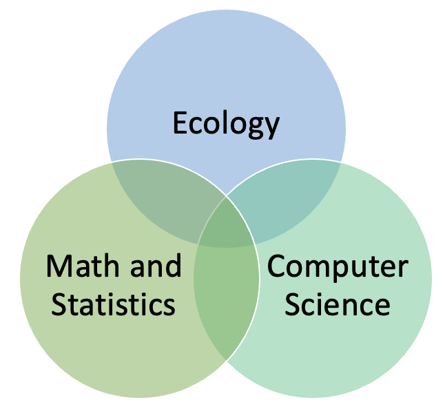
]
]

.right-column[

.center[
## `r icons::fontawesome("satellite")` 
]
### Spatial and temporal patterns in human and biological systems

### - Disease spread
### - Animal movement
### - Fisheries management

]

---
class: middle, left
# Research Interests

.left-column[
.center[

]
]

.right-column[
.center[
## `r icons::fontawesome("satellite")` 
### Use of novel data sources to inform policy
]

### - Satellite imagery
### - Acoustic and GPS tracking
### - Oral Histories


]

???

My work occurs at the intersection of Ecology, Math and Statistics, and Computer Science.

---
class: middle, left
# Research Interests

.left-column[
.center[

]
]

.right-column[
.center[
## `r icons::fontawesome("graduation-cap")`
]
### Broadening access to data science education
### - Teaching inclusive and accessible design
### - Creating open-source education materials

]

???

Overtime my interests have expanded to include equal access to data science education.

---
# Target species in the Chilean longline fishery

.pull-left[

.center[

]

]

.pull-right[
## Topics
### `r icons::fontawesome("fish")`  **Ecology**
### `r icons::fontawesome("globe")` **Spatial Statistics**
### `r icons::fontawesome("satellite")` **Novel Data Sources**

]

### `r icons::fontawesome("lightbulb")` What factors influence a fisher's target species (market value, weather, location, time of year) under different management practices?

???
I used catch composition and machine learning to infer a fisher's target species and used generalized additive models to explore the factors influencing target species.

---
# Grey seals as bioprobes
.pull-left[

.center[

]

]

.pull-right[
## Topics

### `r icons::fontawesome("fish")`  **Ecology**
### `r icons::fontawesome("globe")` **Spatial Statistics**
### `r icons::fontawesome("satellite")` **Novel Data Sources**
]

### `r icons::fontawesome("lightbulb")` What is the detection efficiency of acoustic tags in the field? What potential is there to use grey seals to sample the marine environment?

???


---
# Open-access interactive spatial data tutorials

.pull-left[

.center[
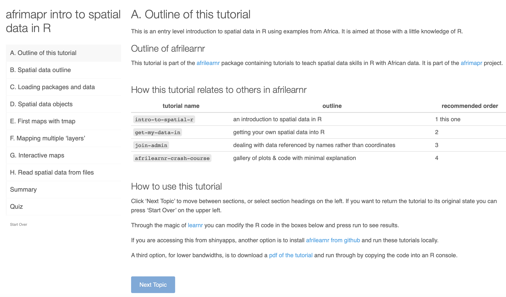
]

]

.pull-right[
## Topics

### `r icons::fontawesome("globe")` **Spatial Statistics**
### `r icons::fontawesome("satellite")` **Novel Data Sources**
### `r icons::fontawesome("desktop")` **Open-source education resources**

]

### `r icons::fontawesome("lightbulb")` Open-access data science educational resources for communities to address issues of local or ecocultural importance

---
# Designing accessible programming lessons

.left-column[

<iframe src="https://laurielbaker.github.io/lab-accessible-data-viz/guide/lab-accessibility.html" width="516" height="516" frameBorder="0"></iframe>

]

.right-column[

## Topics
### `r icons::fontawesome("universal-access")`  **Accessibility**
### `r icons::fontawesome("desktop")` **Open-source education resources**

- In collaboration with Bates students Liza Dubinsky '22 and Max Devon '23.

]

???

---
# Mapping Ocean Stories

.left-column[

.center[
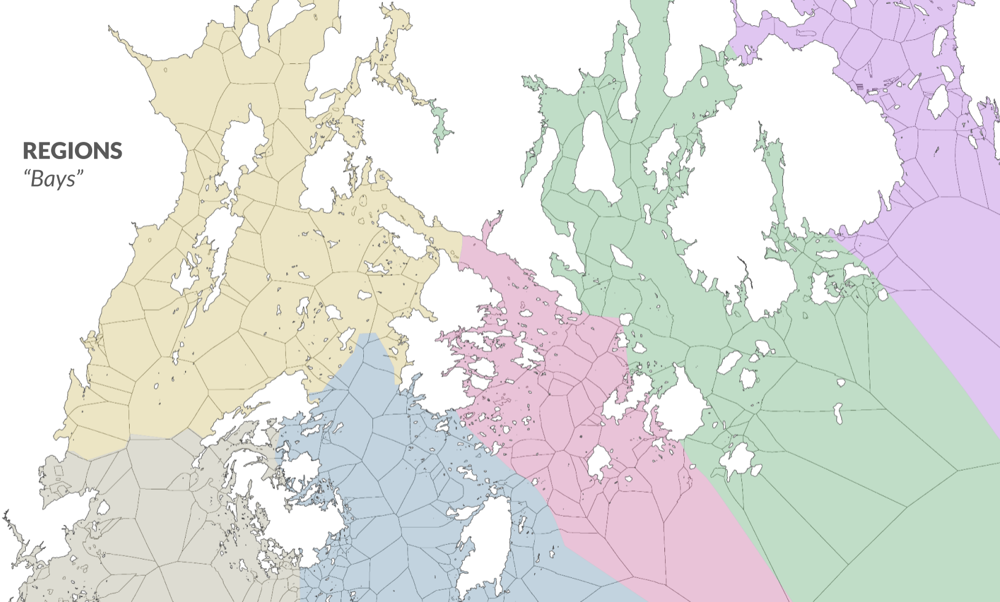
]

Listen to the archives on [Maine Sound and Story](https://mainesoundandstory.com)

]

.right-column[
## Topics
### `r icons::fontawesome("fish")`  **Ecology**
### `r icons::fontawesome("globe")` **Spatial Statistics**
### `r icons::fontawesome("headphones")` **Novel Data Sources**

]

???

---
# Supporting river herring and shad co-management in Maine

.left-column[

<iframe src="https://laurie-the-student-baker.shinyapps.io/shad-river-herring/" width="516" height="516" frameBorder="0"></iframe>

]

.right-column[
## Topics
### `r icons::fontawesome("fish")`  **Ecology**
### `r icons::fontawesome("desktop")` **Data Visualization**

]

???

---
# Spread and control of fox rabies in Europe

.pull-left[
.center[
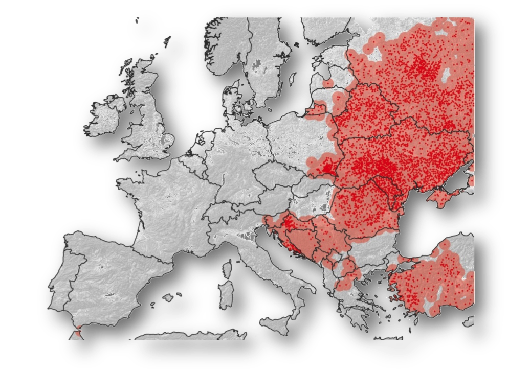
]
]

.pull-right[
## Topics

### `r icons::fontawesome("fish")`  **Ecology**
### `r icons::fontawesome("syringe")`  **Public Health**
### `r icons::fontawesome("globe")` **Spatial Statistics**

]

### `r icons::fontawesome("lightbulb")` What can we learn about vaccination planning from the successful elimination of rabies in Western Europe?

---
class: inverse, center, middle
# Vaccination Planning in the Wild
 
???

The first example is an example of wildlife vaccination planning. 


---
# Background

#### - Only two diseases have been eliminated worldwide: small pox and rinderpest.

```{r, echo=FALSE, out.width=1050, fig.align='center', fig.alt="Two pictures: one of patient's leg with small pox and the other of cattle that have died from rinderpest"}

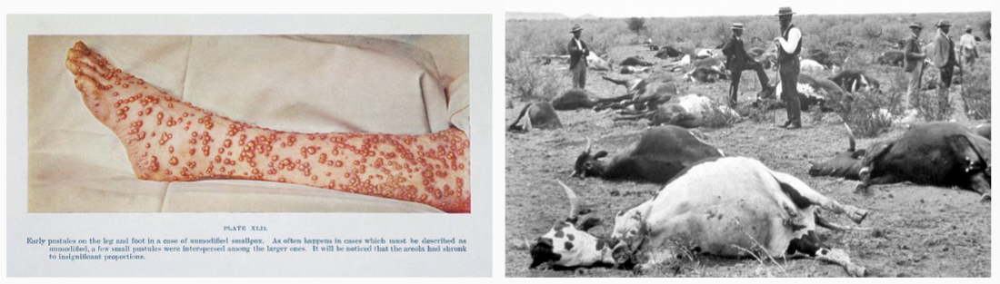

```

#### - Mass vaccination can reduce the burden of diseases. Spatial planning of vaccination campaigns requires understanding of local transmission dynamics. 

???
- Only two infectious diseases have been eliminated worldwide: small pox and rinderpest.

- However, it is unclear how long vaccination programs must operate to eliminate infection. 

- In this talk I am going to explore two different vaccination strategies applied to fox rabies

---
# Rabies
#### Rabies is a deadly disease that kills over 59,000 people each year.
#### An RNA virus that causes encephalitis in a large range of mammals.

```{r, echo=FALSE, out.width=600, fig.align='center', fig.alt="Map of the world with main rabies animal hosts pictured."}

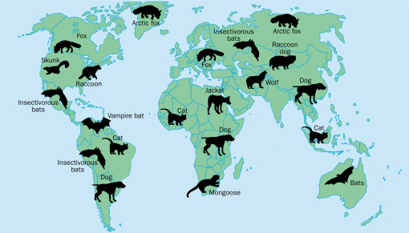

```

.footnote[Rupprecht CE, Hanlon CA, Hemachudha T. Rabies re-examined. Lancet Infect Dis. 2002 Jun;2(6):327-43. doi: 10.1016/s1473-3099(02)00287-6. PMID: 12144896.]

???

* Rabies is a deadly disease that kills over 59,000 people each year, with many millions more requiring expensive life-saving vaccines.
* Rabies is an RNA lyssavirus that causes encephalitis in a large range of mammals. 
* This map shows the primary reservoirs (that is the hosts that perpetuate this disease).
* The main reservoir in Europe is the red fox.

---
# Rabies in Foxes

```{r, echo=FALSE, out.width=750, fig.align='center', fig.cap="Rabies disease cycle in foxes."}

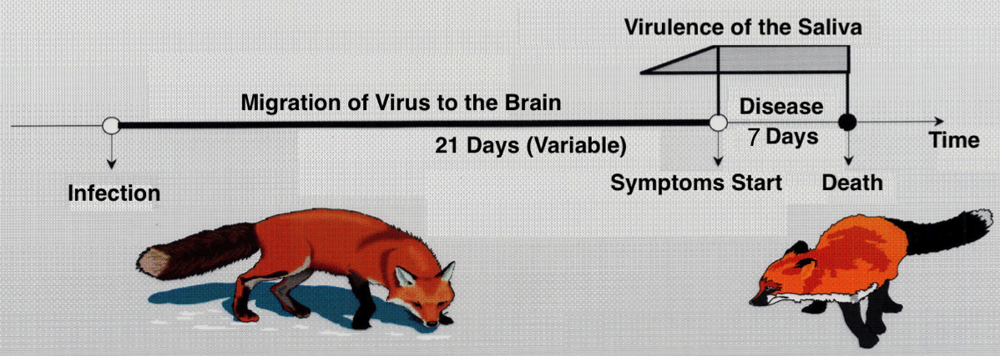

```

- Rabies is spread locally through the bite of an infected animal. 
- Using the gps locations of rabid foxes we can understand the spatial spread of the disease.


---
# Spread of rabies in foxes

.left-column[
```{r, echo=FALSE, out.width=850, fig.align='center', fig.alt="Map of the spread of rabies in foxes across Europe."}

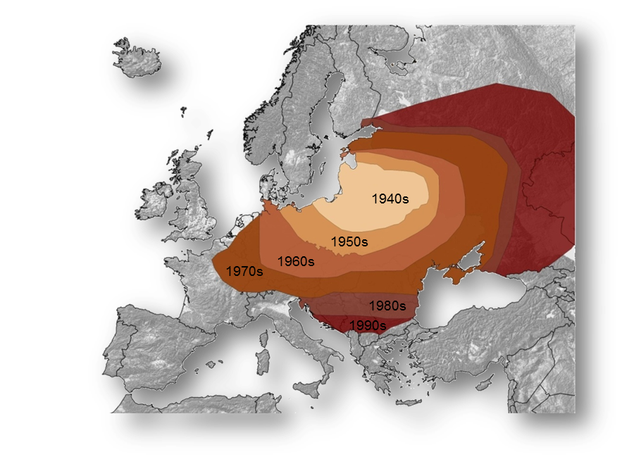

```


.footnote[Figure courtesy of the Friedrich Loeffler Institut]

]
.right-column[


]

* **1940s:** Spillover from dogs to foxes

--

* **1950s-1970s:** Rapid spread throughout Europe

--

* **Late 1970s:** Veterinarians facing major health crisis

--

`r icons::fontawesome("pizza-slice")` Lunch Warning: Next Slide

---
# Vaccine Deployment

.left-column[

```{r, echo=FALSE, out.width=400, fig.align='center', fig.cap="Image 1. Fixed wing aircraft used to distribute vaccines."}

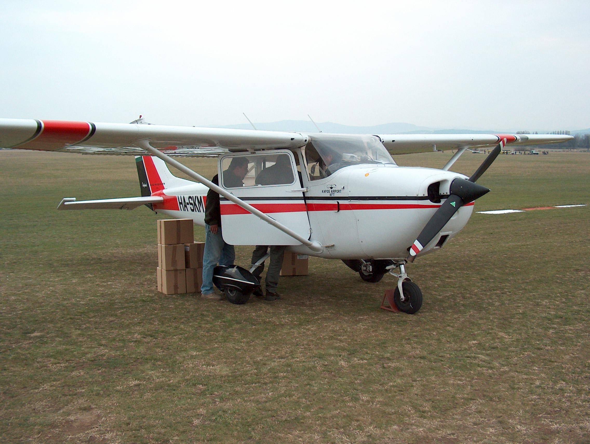


```

`r icons::fontawesome("newspaper")` Read more in *The Atlantic* article by Ed Yong ["That Time Europe Air-dropped Vaccine-loaded Chicken Heads to Bait Rabid Foxes"](https://www.theatlantic.com/science/archive/2015/12/that-time-europe-air-dropped-vaccine-loaded-chicken-heads-to-bait-rabid-foxes/417951/) 

.footnote[Images: Friedrich Loeffler Institut]
]

.right-column[

```{r, echo=FALSE, out.width=520, fig.align='center', fig.cap="Image 2. Vaccine-loaded chicken heads."}

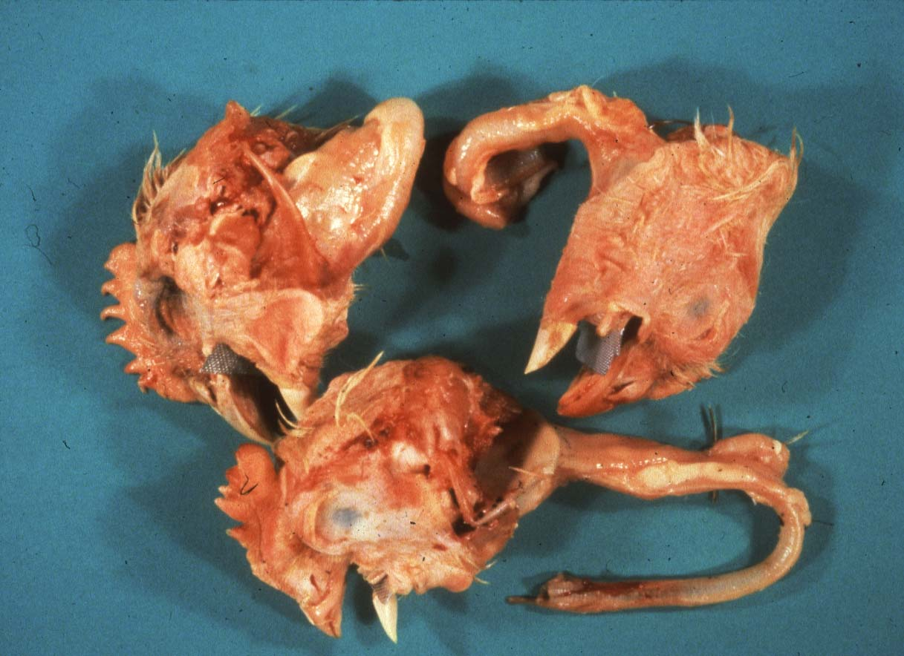


```

]

`r icons::fontawesome("syringe")` At least they didn't go with the spring-loaded needle traps!


---
# Vaccine Deployment

.left-column[
```{r, echo=FALSE, out.height=470, out.width = 640, fig.align='center', fig.alt="Animation showing rabies cases and the historical distribution of vaccines. Image credit: Friedrich Loeffler Institute"}
knitr::include_graphics("images/western_europe_vac_cases_oct_2016.gif")
```

.footnote[<span style="color: blue;">Blue polygons:</span> vaccination campaigns; <span style="color: red;">Red dots:</span> reported rabies cases]

]

.right-column[
.center[

#### `r icons::icon_style(icons::fontawesome("shield-virus"), scale = 2)`

### Over 30 years, vaccinated 2.36 million square km (330,000 football fields)

#### `r icons::icon_style(icons::fontawesome("globe"), scale = 2)`

### Rabies eliminated from 9 countries in W. Europe

]
]

???

Over three decades, vaccine loaded chicken-heads were air-dropped across Europe covering a total of 2.36 million square kilometers, the equivalent of 550,000 soccer fields. 

---
class: middle
# Project Aims

.center[
### `r icons::icon_style(icons::fontawesome("viruses"), scale = 2)`

## 1. Capture rabies spread and control and estimate key epidemiological parameters

### `r icons::icon_style(icons::fontawesome("globe"), scale = 2)`


## 2. Use the model to design **optimal** vaccination strategies and explore "what if" policy scenarios 

]
---
# 1: Fit a model to data to capture rabies dynamics

### `r icons::icon_style(icons::fontawesome("firefox-browser"), scale = 2)` Fox ecology: spring birth pulse, death

--

### `r icons::icon_style(icons::fontawesome("viruses"), scale = 2)` Disease Ecology: infection, migration between regions

--

### `r icons::icon_style(icons::fontawesome("shield-virus"), scale = 2)` Vaccination: vaccination events (where and when)

.footnote[
[**Baker L**, Matthiopoulos J, Müller T, Freuling C, Hampson K (2020) Local rabies transmission and regional spatial coupling in European foxes. **PLoS ONE** 15(5): e0220592. https://doi.org/10.1371/journal.pone.0220592](https://journals.plos.org/plosone/article?id=10.1371/journal.pone.0220592)]


---
# The data and model

.left-column[

```{r, echo=FALSE, out.height=470, out.width = 400, fig.align='center', fig.alt="Animation showing rabies cases and the historical distribution of vaccines in Eastern Germany."}
knitr::include_graphics("images/vaccinationrate.gif")
```

]

.right-column[

#### - Monthly fox rabies cases from 5 federal states in Eastern Germany from 1982-2013
#### - GIS shapefiles of where oral rabies vaccines were dropped. 
#### - Discrete time stochastic metapopulation model with three states: Susceptible (S), Infected (I), and Vaccinated (V)
#### - Using a Bayesian state-space modelling approach which able to include prior information for several model parameters and incorporate imperfect detection of rabies cases.

]

???

---
# Susceptible Individuals

Susceptible individuals $S$ in region $r$, in month $t$ were modeled as a function of juvenile foxes entering the population $j_{r,t}$, surviving individuals $C_{r,t}$ and those removed due to vaccination $V_{r,t}$ or infection $I_{r,t}$:

\begin{eqnarray}
S_{r,t+1} = j_{r,t} + C_{r,t} - V_{r,t} - I_{r,t}
\end{eqnarray}

---
# Infected individuals

Infected individuals are modeled as:

\begin{eqnarray}
I_{r,t} = (1-\rho_{r})I^{*}_{r,t} + \sum_{i \not= r} \rho_{i}l_{i,r}I^{*}_{i,t}
\end{eqnarray}

where $I^{*}_{r,t}$ is the number of infected individuals in region $r$ prior to any movement. Infected individuals leave the region with probability $\rho_{r}$. The summation term represents incursions from other regions as a function of rabies incidence $I^{*}_{i,t}$ in region $i$, the proportion of infected animals leaving region $i$: $\rho_{i}$, and $l_{i,r}$ the proportion of those moving to region $r$. 

---
# Vaccinated Individuals

Vaccinated individuals were modeled as:
\begin{eqnarray}
V_{r,t+1} = v_{r,t} + X_{r,t}
\label{eq_vac}
\end{eqnarray}

where $v_{r,t}$ represents the newly vaccinated individuals drawn from a binomial distribution. $X_{r,t}$ represent surviving vaccinated individuals.

\begin{eqnarray}
v_{r,t} \sim B(\nu\frac{S_{r,t}}{S_{r,t}+V_{r,t}}, S_{r,t})
\end{eqnarray}

and $\nu$ is the rate of bait uptake by the population of susceptible and vaccinated individuals in region $r$ at time $t$. The bait uptake rate $\nu$ was given a fixed Beta prior with mean 0.30 and variance of 0.005 based on field studies. 

---
# Observation Process

We assumed that infected individuals $I_{r,t}$ were observed imperfectly each year with probability $\theta_y$:

\begin{eqnarray}
\widehat{I}_{r,t} \sim Bin(\theta_y, I_{r,t})
\end{eqnarray}


where the observational noise $\theta_y$ varies stochastically on an annual basis. 

In the cross-sectional sampling regime, hunted foxes $H_{r,t}$ had a probability of being observed to be infected equal to the risk of transmission $p_{r,t}$.

\begin{eqnarray}
\widehat{H}pos_{r,t} \sim B(p_{r,t}, H_{r,t})
\end{eqnarray}

where $\widehat{H}pos_{r,t}$ is the number of positive cases out of the total foxes hunted $H_{r,t}$.
---
## 2. Explore vaccination planning for different rabies scenarios

.left-column[
```{r, echo=FALSE, out.width=700, fig.align='center', fig.cap="Map showing the rabies retreat from Western Europe."}
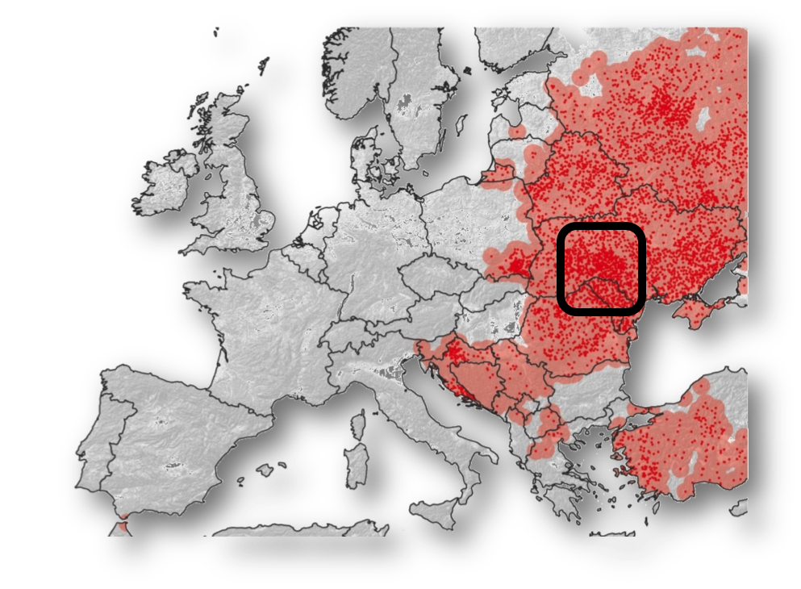
```
]

.right-column[

### 1. Endemic

]

---
## 2. Explore vaccination planning for different rabies scenarios

.left-column[
```{r, echo=FALSE, out.width=700, fig.align='center', fig.cap="Map showing the rabies retreat from Western Europe. Black box indicating high-risk areas."}
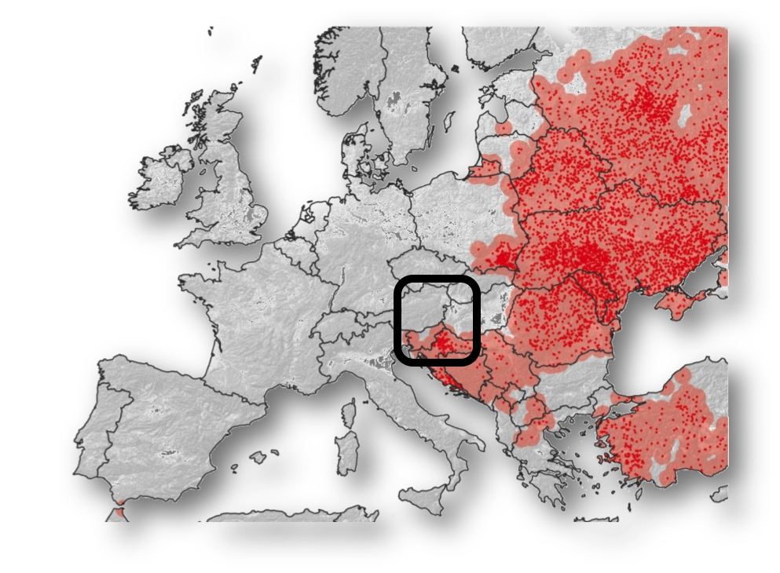
```
]

.right-column[

### 1. Endemic

### 2. High-risk

]

---
## 2. Explore vaccination planning for different rabies scenarios

.left-column[
```{r, echo=FALSE, out.width=700, fig.align='center', fig.cap="Map showing the rabies retreat from Western Europe. Black box indicating high-risk areas."}
knitr::include_graphics("images/rabies_retreat_end_game.png")
```
]

.right-column[

### 1. Endemic

### 2. High-risk

### 3. Endgame

]

---
# Study

.left-column[
```{r, echo=FALSE, out.width=470, fig.align='center', fig.alt="Map showing different rabies scenarios: endemic (all 5 regions); high-risk (3 regions infected); end game (1 region infected)."}

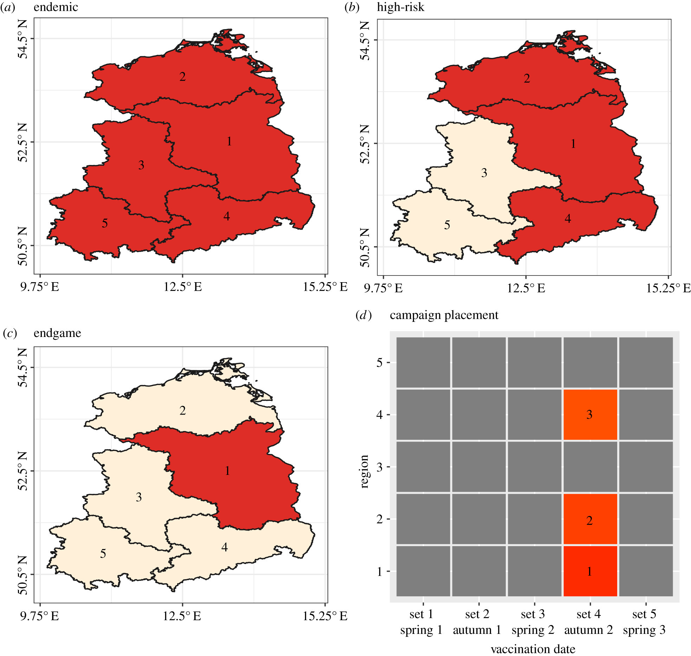


```
]

.right-column[

.center[

`r icons::icon_style(icons::fontawesome("globe"), scale = 2)`

### Where and When?


`r icons::icon_style(icons::fontawesome("clock"), scale = 2)`

### How many to achieve elimination?

]
]

.footnote[
[**Baker LL**, Matthiopoulos J, Müller T, Freuling C, Hampson K (2019). Optimizing
spatial and seasonal deployment of vaccination campaigns to eliminate wildlife
rabies. **Phil. Trans. R. Soc. B.** 374.](https://royalsocietypublishing.org/doi/10.1098/rstb.2018.0280)]

---
# Study

.left-column[
```{r, echo=FALSE, out.width=470, fig.align='center', fig.alt="Time series showing the impact of vaccination on rabies incidence."}


```
]

.right-column[

.center[

.left-column[

### The model in pseudo-code

`for(t in 1:endTime){

    for(r in 1:numRegions){
    
        populationSim()
        vaccinationSim()
        migrationSim()
        infectionSim()
      
    }
}`

]
]
]

.footnote[
[**Baker LL**, Matthiopoulos J, Müller T, Freuling C, Hampson K (2019). Optimizing
spatial and seasonal deployment of vaccination campaigns to eliminate wildlife
rabies. **Phil. Trans. R. Soc. B.** 374.](https://royalsocietypublishing.org/doi/10.1098/rstb.2018.0280)]

---
# Endemic

.left-column-big[
```{r, echo=FALSE, out.width=750, fig.align='center', fig.cap="Endemic (rabies in all 5 regions)."}

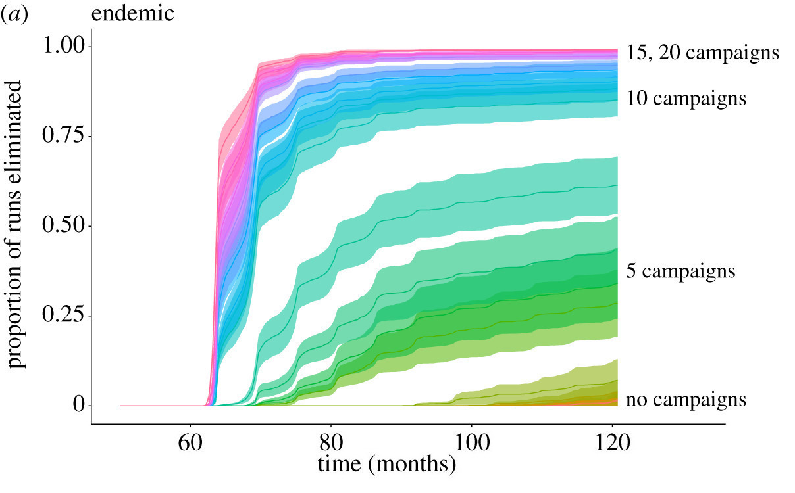

```
]

.right-column-small[
```{r, echo=FALSE, out.width=200, fig.align='center', fig.alt="Endemic (rabies in all 5 regions)."}

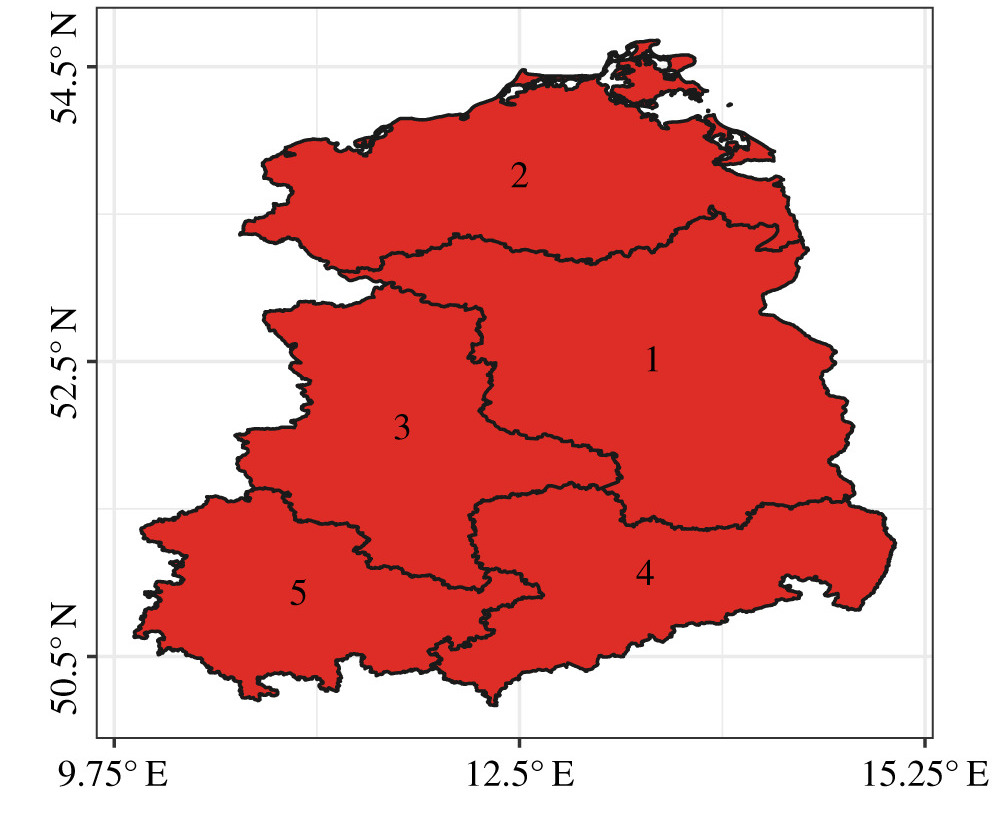

```

### `r icons::icon_style(icons::fontawesome("clock"), scale = 2)` Autumn campaigns -> greatest reductions


]

---
# Endemic: Time to elimination


```{r, echo=FALSE, out.width=880, fig.align='center', fig.alt="Endemic (incidence ratio)."}

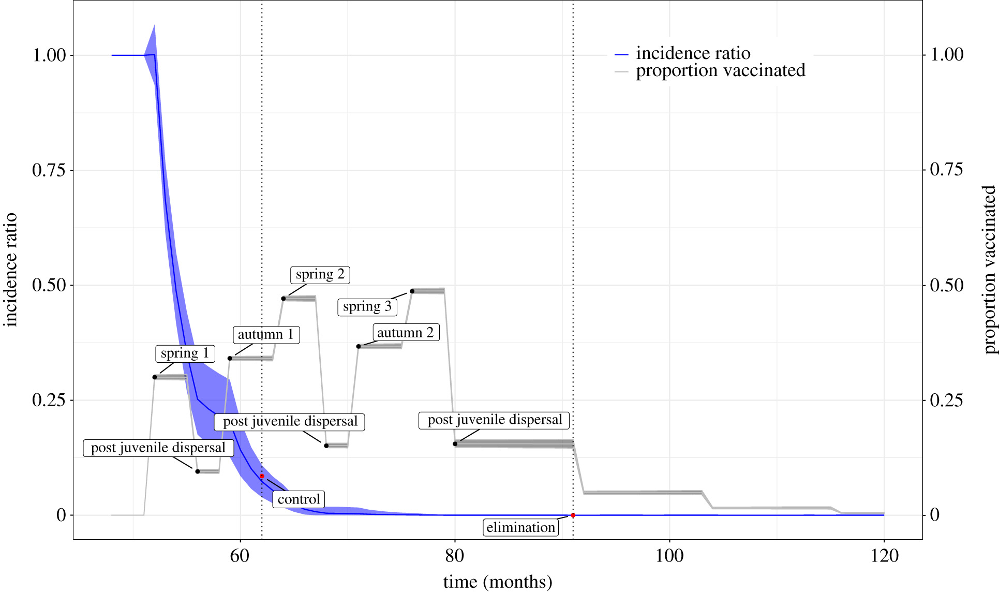

```

---
# High-risk

.left-column-big[

```{r, echo=FALSE, out.width=750, fig.align='center', fig.alt="Time series plot showing the proportion of runs eliminated over time in a high-risk scenario."}

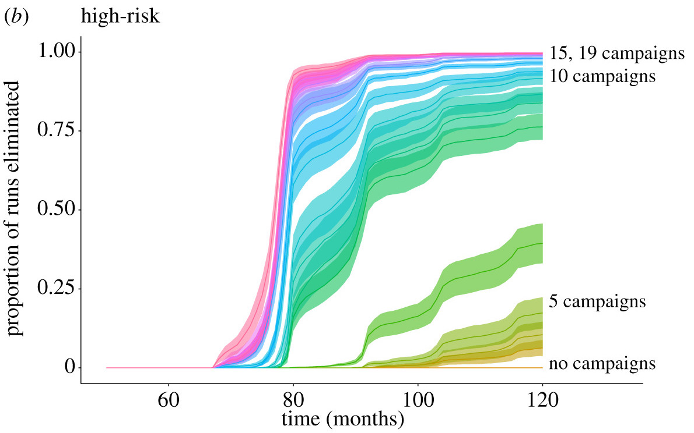

```

]
.right-column-small[

```{r, echo=FALSE, out.width=200, fig.align='center', fig.alt="Map showing high-risk scenario where 3 of 5 regions are infected."}

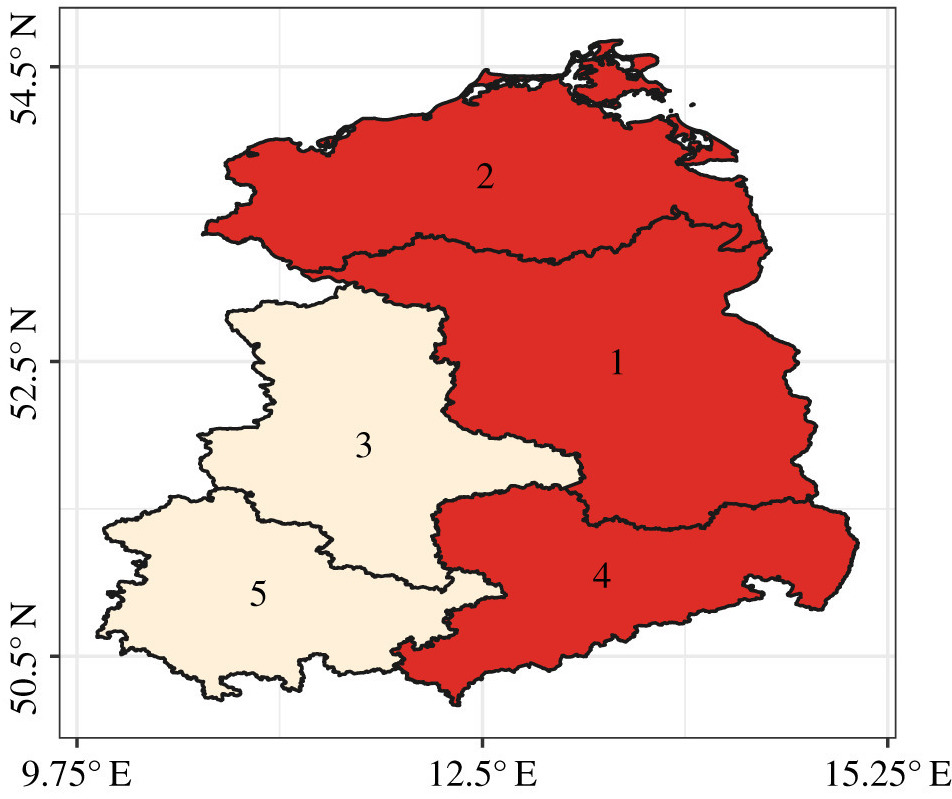

```

### Similar effort in high-risk and endemic 


]

---
# Endgame

.left-column-big[

```{r, echo=FALSE, out.width=700, fig.align='center', fig.alt="Time series of the proportion of runs eliminated vs the number of vaccination campaigns in the endgame scenario"}

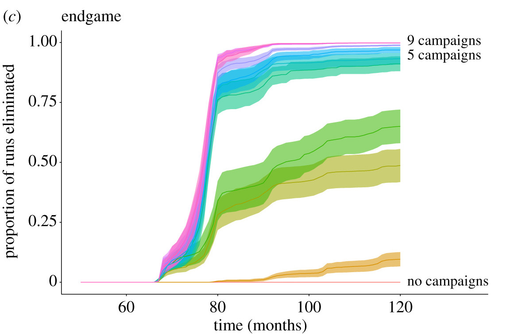

```

]
.right-column-small[

```{r, echo=FALSE, out.width=200, fig.align='center', fig.alt="Map of the endgame scenario where only one region that is infected remains."}

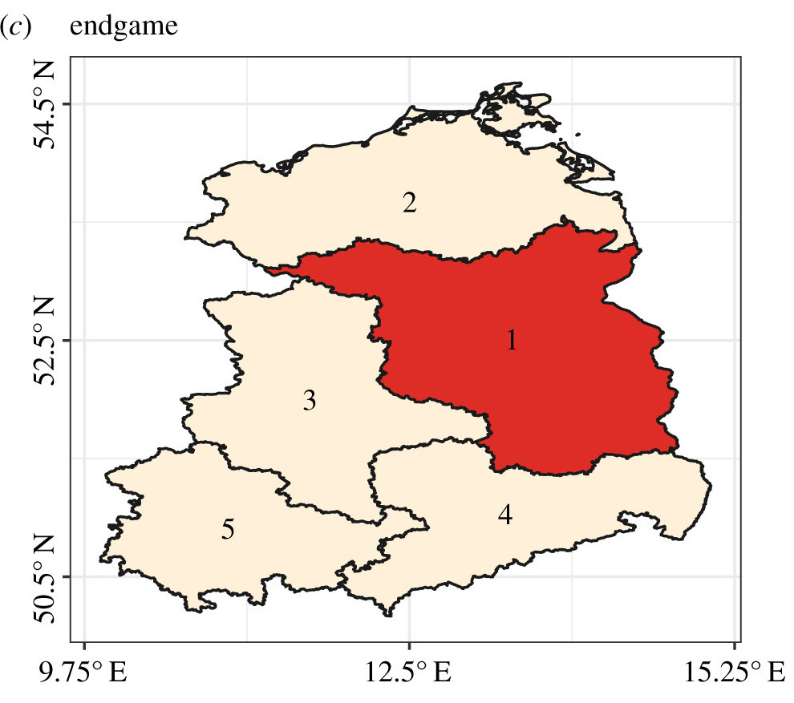

```

### Autumn campaigns required in rabies-free regions

]


???

This figure shows the probability of elimination and ranked importance of campaigns across epidemiological scenarios. Left panels show the probability of elimination from all five regions in response to incremental vaccination (mean, and shaded 95% CI). (a) In the endemic scenario, 21 campaigns were required to eliminate rabies from all regions. (b) In the high-risk scenario, 19 campaigns were required to eliminate rabies from all regions, with vaccination of the endemic regions ranked first, and vaccination after the birth pulse (months 56 and 68) contributing most to the probability of elimination. A minimum of two or three campaigns was required in neighbouring rabies-free regions. (c) In the endgame scenario, nine campaigns were required to eliminate rabies from all regions.


What we can see from these results is that:

1. Similar effort is required in high-risk and endemic, even though fewer regions were initially infected. 


2. Autumn campaigns were ranked highest and resulted in the greatest reductions in rabies because they come after the birth pulse. 

3. Vaccination needed in rabies-free regions. Because rabies moves across borders, vaccination is still required in neighboring regions. 
---
# Impact of Missing Campaigns

.left-column[

```{r, echo=FALSE, out.width=700, fig.align='center', fig.cap="Time to elimination for different scenarios where campaigns were missed."}

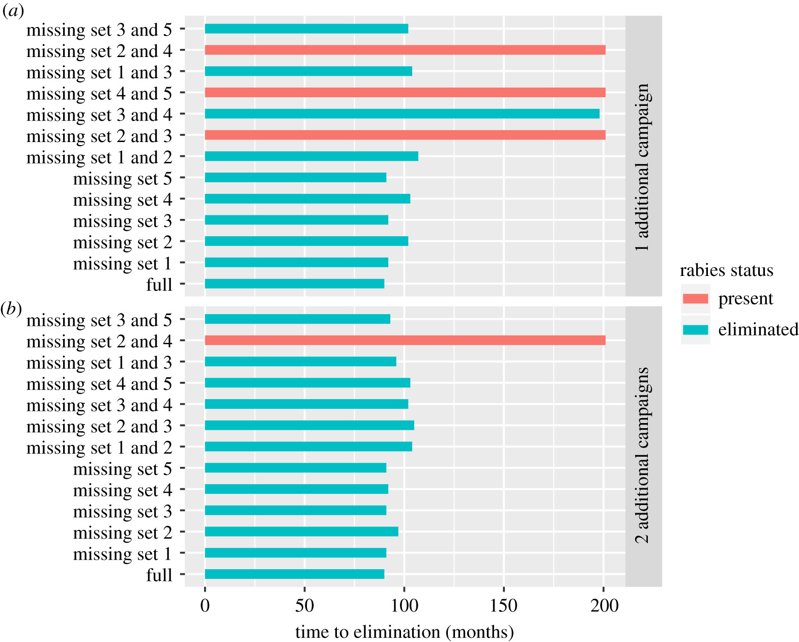


```

]

.right-column[

.center[
`r icons::icon_style(icons::fontawesome("clock"), scale = 2)`

### Delay elimination


`r icons::icon_style(icons::fontawesome("money-bill-alt"), scale = 2)`

### Require more effort

`r icons::icon_style(icons::fontawesome("baby"), scale = 2)`

### Consecutive and autumn campaigns greatest setbacks

]
]


???

I also looked at what happens when things go wrong and we miss campaigns.

* We found that consecutive and coordinated vaccination across geographical regions is required to rapidly control and eliminate rabies

* Incomplete vaccination (missing campaign sets) compromised time to elimination, with the same or more effort required to achieve elimination and meet similar timelines. 

- It is, therefore, important that policymakers commit to the full elimination timeline and strive to maintain comprehensive coverage to eliminate persistent foci and prevent further costs.

---
class: center
# Take Home:

.center[
`r icons::icon_style(icons::fontawesome("hands-helping"), scale = 2)`

### 1. Coordinated and sustained effort required to control and eliminate rabies
]


--

`r icons::icon_style(icons::fontawesome("paw"), scale = 2)`

.center[
### 2. Vital to account for fox population dynamics in vaccination planning
]

--

`r icons::icon_style(icons::fontawesome("desktop"), scale = 2)`

.center[
### 3. Statistics can help us explore "what if" scenarios
]

---
# Thank You!

.left-column[
```{r, echo=FALSE, out.width=400, fig.align='center', fig.cap="PhD Celebration Cake with fox and chicken heads on it"}

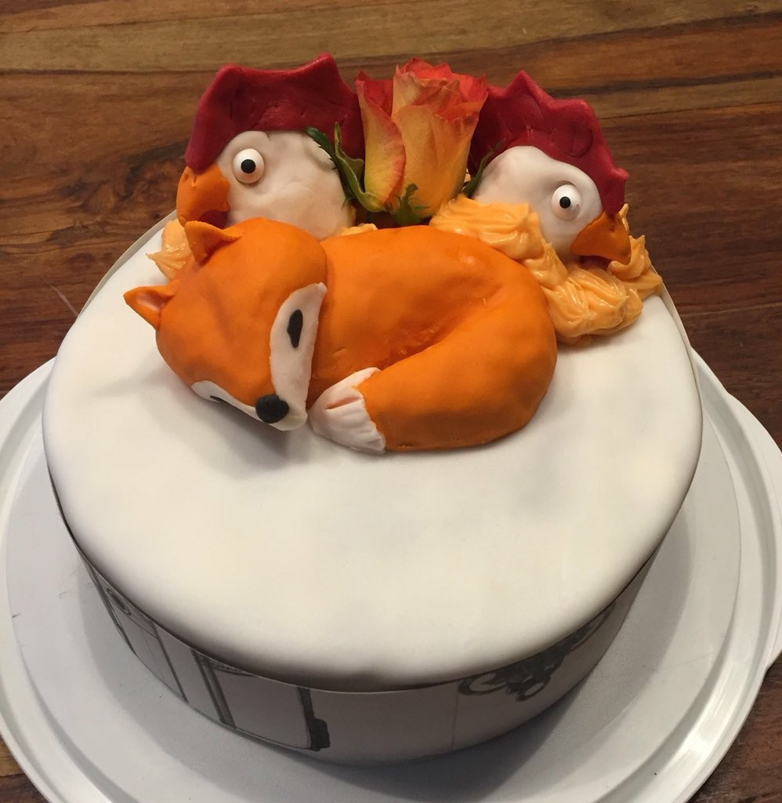

```


Slides created via the R package [**xaringan**](https://github.com/yihui/xaringan).

The chakra comes from [remark.js](https://remarkjs.com), [**knitr**](http://yihui.name/knitr), and [R Markdown](https://rmarkdown.rstudio.com).
]

.right-column[

**University of Glasgow**: 

Prof. Katie Hampson; 
Micaela De la Puente León;
Prof. Jason Matthiopoulos

**Friedrich Loeffler Institut**: 

Dr. Thomas Müller; Dr. Conrad Freuling; Patrick Wysocki

**Afrimapr**: 

Dr. Andy South (LSTM); Dr. Ahmadou Dicko (FAO, Senegal); Shelmith Kariuki (Nairobi, Kenya); Anelda Van der Walt (Talarify)

**FCDO & ONS, UK**:  
Dr. Joseph Crispell; Nathan Begbie; Saliha Minhas; Jonathon Mellor; Richard Leyshon

]

---
class: inverse, center, middle
# Additional slides

???

---
class: inverse, center, middle
# Courses I teach and am interested in teaching

---
class: center
# My courses center 

`r icons::icon_style(icons::fontawesome("lightbulb", style = "solid"), scale = 2)`
### Ethics of inquiry

--

`r icons::icon_style(icons::fontawesome("globe"), scale = 2)`
### Actionable positive change

--

`r icons::icon_style(icons::fontawesome("users"), scale = 2)`
### Accessible and inclusive design


???
With the freedom to work on and choose project and questions that are meaningful to you.

---
class: center
# Curriculum objectives

`r icons::icon_style(icons::fontawesome("tools", style = "solid"), scale = 2)` 
### Develop skills in data analysis and statistics and learn to apply these skills with an intersectional lens

--

`r icons::icon_style(icons::fontawesome("users", style = "solid"), scale = 2)` 

### Work with and engage with communities across Maine and worldwide

--

`r icons::icon_style(icons::fontawesome("hands-helping", style = "solid"), scale = 2)` 
### Apply data science to local and global issues you care about

???

- I'm excited about the opportunity to 
  - Help you to build your data science tool set
  - support you in applying these tools to issues you care about.
  - work and engage with communities across Maine.
- I look forward to hearing after this talk about the questions that you are excited about exploring.


---
class: inverse, center, middle
# Data Visualization

<iframe src="https://coa-dataviz.netlify.app" width="716" height="516" frameBorder="0"></iframe>

---
class: inverse, center, middle
# Data Analysis

<iframe src="https://coa-data-analysis.netlify.app" width="716" height="516" frameBorder="0"></iframe>

---
class: inverse, center, middle
# Community-Engaged Data Science Short-Term

<iframe src="https://community-engaged-data-science.netlify.app" width="716" height="516" frameBorder="0"></iframe>

---
class: inverse, center, middle
# Community-Engaged Data Science


<iframe src="https://coa-community-data-science.netlify.app" width="716" height="516" frameBorder="0"></iframe>


---
class: inverse, center, middle
# Intro to Epidemiological Modeling

<iframe src="https://coa-epi-modelling.netlify.app" width="516" height="716" frameBorder="0"></iframe>

---
class: inverse, center, middle
# Navigating Change

<iframe src="https://coa-navigating-change.netlify.app" width="716" height="516" frameBorder="0"></iframe>

---
class: inverse, center, middle
# Courses I'd like to develop

### An Introduction to Bayesian Statistics

### Spatial Data Analysis

### Mapping Ocean Stories