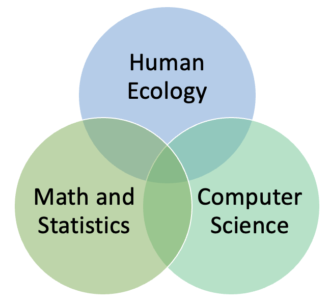
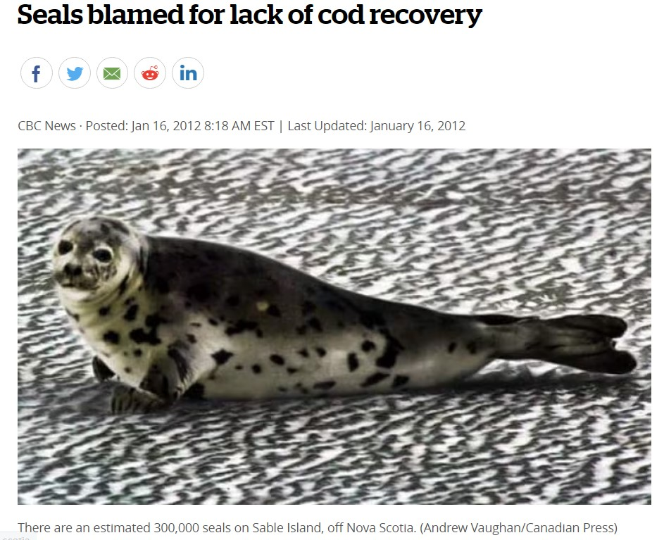
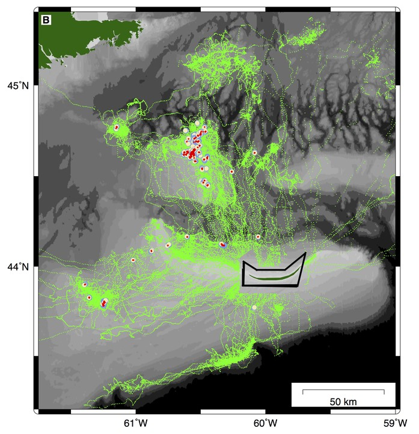
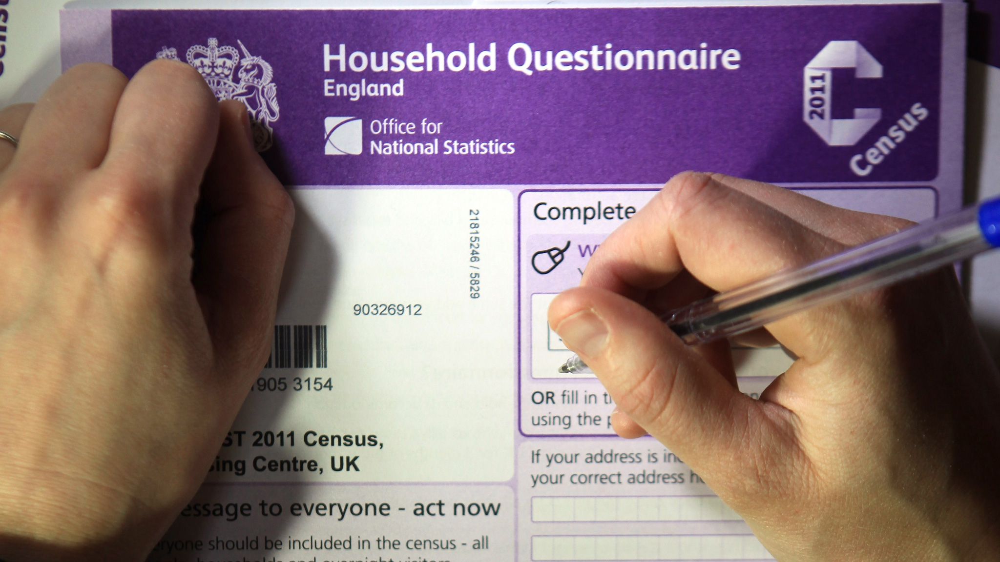
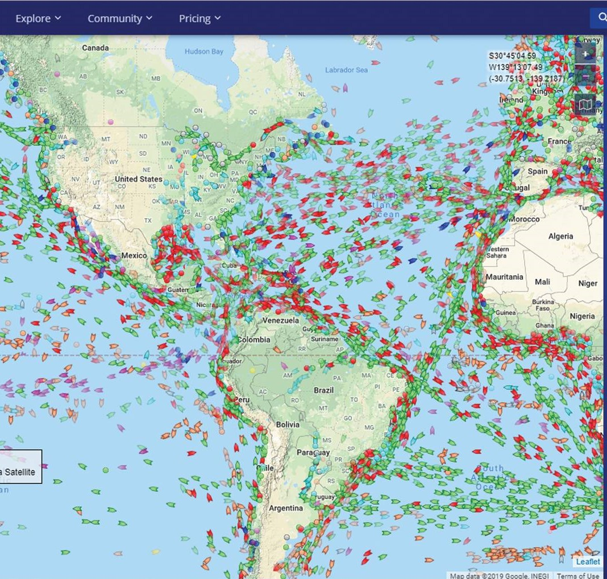

```{r libraries, results='hide', message = FALSE, echo = FALSE,  warning = FALSE}

#install.packages("tidyverse")
#install.packages("readxl")
#devtools::install_github("gadenbuie/xaringanExtra")
#install.packages("fontawesome")


library(dplyr)
library(leaflet)
library(readxl)
library(xaringanExtra)
library(fontawesome)
library(icons)
library(DT)
library(htmltools)
library(htmlwidgets)
library(kableExtra)
library(readr)

knitr::opts_chunk$set(message=FALSE, warning=FALSE, hiline=TRUE)

xaringanExtra::use_xaringan_extra(include = c("panelset", "tile_view", "share_again", "use_broadcast"))

xaringanExtra::style_share_again(share_buttons = c("twitter", "linkedin", "pocket"))


```


background-image: url(images/tidydata_5.jpg)
background-position: bottom right
background-size: contain
class: left

.center[
## **`r rmarkdown::metadata$title`**

### `r rmarkdown::metadata$subtitle`,  `r rmarkdown::metadata$date`
]


---
class: middle, left
# About me

.pull-left[

.center[


### Dr. Laurie Baker

]]

.pull-right[

### `r icons::fontawesome("desktop")` Data Science Lecturer, Data Science Campus, Office for National Statistics, UK
### `r icons::fontawesome("graduation-cap")` Visiting Assistant Professor, Digital and Computational Studies, Bates College
### `r icons::fontawesome("graduation-cap")` Faculty Member, Computer Science, College of the Atlantic

]

.center[
[`r icons::fontawesome("link")` lauriebaker.rbind.io](https://lauriebaker.rbind.io)
[`r icons::fontawesome("twitter")` @llbaker1707](https://twitter.com/llbaker1707)
[`r icons::icon_style(icons::fontawesome("github"), scale = 1)` @laurielbaker](https://github.com/laurielbaker)
]
???

---
class: middle, left
# Research Interests

.left-column[
.center[

]
]

.right-column[

.center[
## `r icons::fontawesome("satellite")` 
### Spatial and temporal patterns in human and biological systems

### Use of novel data sources to inform policy

### Open-access education materials
]
]

---
# Background

### - Need for finer scale spatial and temporal data for decision-making

--

### - Wealth of new environmental information and data from new sources becoming available

--

### - How can we leverage existing data sources and be creative with new data sources?

---
# Grey seals as bioprobes

.pull-left[

.center[

]

]

.pull-right[
## Initial Research Questions

### `r icons::fontawesome("fish")`  Are seals eating cod?
### `r icons::fontawesome("fish")` How much cod?
### `r icons::fontawesome("fish")` Is it having a negative effect?
]

---
# Grey seals as bioprobes

.pull-left[

.center[

<iframe src="https://www.google.com/maps/embed?pb=!1m18!1m12!1m3!1d367544.6964222735!2d-60.215552395501966!3d43.97088868870316!2m3!1f0!2f0!3f0!3m2!1i1024!2i768!4f13.1!3m3!1m2!1s0x4b4689632ca41c27%3A0xfcd36f09136414e!2sSable%20Island!5e0!3m2!1sen!2sus!4v1630508253565!5m2!1sen!2sus" width="500" height="400" style="border:0;" allowfullscreen="" loading="lazy"></iframe>

]

]

.pull-right[

.center[
## `r icons::fontawesome("globe")` 

### Sable Island is a small 13 km2 island home to 300,000 Grey Seals
]
]

???


---
# Grey seals as bioprobes
.pull-left[

.center[

]

]

.pull-right[
## Are grey seals negatively impacting cod?

### `r icons::fontawesome("fish")`  Tagged cod with acoustic tags
### `r icons::fontawesome("satellite")` Tagged grey seals with acoustic transceivers, time, depth, temperature recorders and gps tags.

]


???

---
# Grey seals as bioprobes
.pull-left[

.center[

]

]

.pull-right[
## Can grey seals be used as bioprobes?

.center[

### `r icons::fontawesome("globe")` Grey seals can sample areas at times ships can't
### `r icons::fontawesome("temperature-low")` Potential to collect important oceanographic and biological info

]

]

???


---
# Grey seals as bioprobes
.pull-left[

.center[

]

]

.pull-right[

.center[

## `r icons::fontawesome("globe")`  

### Grey seals collectively sampled an area of 11,308 km from June-December. 
### Largest area in July (2094.56 km2) and smallest in August (1259.80 km2)

]
]

--

### `r icons::fontawesome("lightbulb")` 

???

---
# National Statistics Offices

.pull-left[

.center[

]
© Getty Images, [Financial Times](https://www.ft.com/content/380c2bd4-116b-11e3-a14c-00144feabdc0)

]

.pull-right[

.center[

### Most well known for the Census

[**Census goal:** "The census asks questions about you, your household and your home. In doing so, it helps to build a detailed snapshot of our society. Information from the census helps the government and local authorities to plan and fund local services, such as education, doctors' surgeries and roads."](https://www.ons.gov.uk/census/aboutcensus)

### Challenge: only every 10 years... 


]
]


### How can we leverage novel sources of big data to get faster statistics?


---
# Faster Indicators of Economic Activity

.pull-left[

.center[

]
]

.pull-right[

### - Automated Identification System (AIS) provides high resolution data on shipping.

### - Reports a vessel position, speed, and heading every 2 seconds when moving and 3 minutes when anchored.

### - Approximately 28 million messages per day

]

---
# Faster Indicators of Economic Activity

.pull-left[

.center[

]
]

.pull-right[

### Number of vessels, trips, and time spent in major UK ports.

### Good correlation between the shipping indicators and international trade in goods, especially imports.

### Presents a valuable complimentary indicator to ONS and HMRC official statistics. 

[Article: Faster Indicators of UK Economic Activity](https://datasciencecampus.ons.gov.uk/projects/faster-indicators-of-uk-economic-activity-shipping/)

]

---
# Open-access education materials

.pull-left[

.center[
<iframe src="https://rspatialdata.github.io/" width="700" height="416" frameBorder="0"></iframe>

]
]

.pull-right[

### **rspatialdata**: Accessing spatial data using R. 

]

???
Open access education resources play a huge role in making the most of data resources

Several projects that aim to equip communities with data science tools to address issues of local importance.

RSpatial Data
---
# Open-access education materials

.pull-left[

.center[
<iframe src="https://andysouth.shinyapps.io/intro-to-spatial-r/" width="700" height="416" frameBorder="0"></iframe>

]
]

.pull-right[
### **Afrimapr** interactive tutorials on working with spatial data in R
]


---
# Community-engaged Data Science

.pull-left[

.center[
<iframe src="https://community-engaged-data-science.netlify.app/" width="700" height="416" frameBorder="0"></iframe>

]
]

.pull-right[
### Teaching applied problem-solving
]


---
# Thank You!


Slides created via the R package [**xaringan**](https://github.com/yihui/xaringan).

The chakra comes from [remark.js](https://remarkjs.com), [**knitr**](http://yihui.name/knitr), and [R Markdown](https://rmarkdown.rstudio.com).
]

Artwork by @AllisonHorst


**Dalhousie University**: 

Prof. Joanna Mills-Flemming; Prof. Ian Jonsen; Prof. Sara Iverson; Dr. W. Don Bowen; Dr. Damian Lidgard


**Rspatial Data Colleagues**: 

Prof. Paula Moraga; Dilinie Seimon; Varsha Ujjinni Vijay Kumar; Dr. Andre Ribeiro Amaral


**Afrimapr**: 

Dr. Andy South (LSTM); Dr. Ahmadou Dicko (FAO, Senegal); Shelmith Kariuki (Nairobi, Kenya); Anelda Van der Walt (Talarify)

**FCDO & ONS, UK**:  
Dr. Joseph Crispell; Nathan Begbie; Saliha Minhas; Jonathon Mellor; Richard Leyshon


---
# References

- Faster Economic Indicators: https://datasciencecampus.ons.gov.uk/projects/faster-indicators-of-uk-economic-activity-shipping/
- Moraga, P and Baker LL. rspatialdata: a collection of data sources and tutorials on downloading and visualising spatial data using R. F1000Research 2022, 11:770 (https://doi.org/10.12688/f1000research.122764.1)

- Baker LL, Mills Flemming JE, Jonsen ID, Lidgard DC, Iverson SJ, and Bowen WD (2015). A novel approach to quantifying the spatiotemporal behavior of instrumented grey seals used to sample the environment. Movement Ecology 3(20). 
- Baker LL, Jonsen ID, Mills Flemming JE, Lidgard DC, Bowen WD, Iverson SJ, and Webber DM (2014). Probability of detecting marine predator-prey and species interactions using novel hybrid acoustic transmitter-receiver tags. PLoS ONE 9(6).