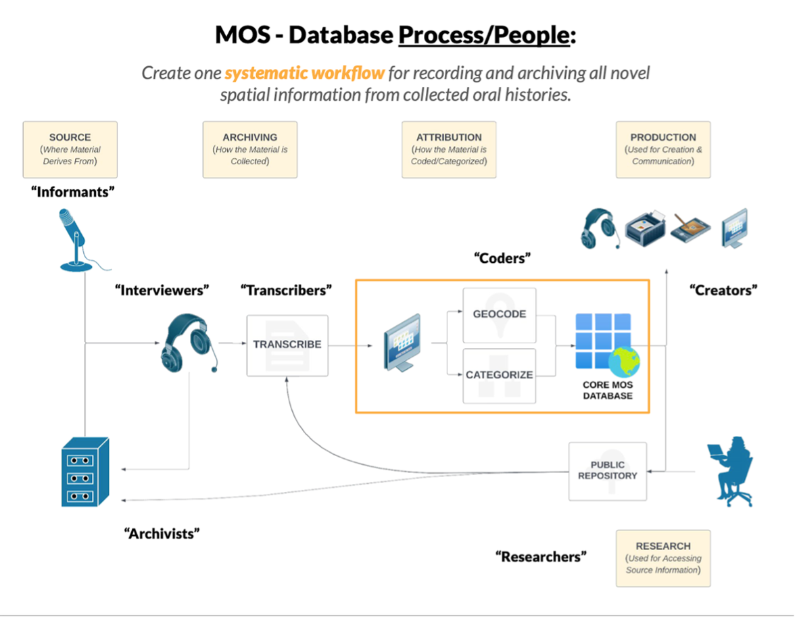

```{r libraries, results='hide', message = FALSE, echo = FALSE,  warning = FALSE}

#install.packages("tidyverse")
#install.packages("readxl")
#devtools::install_github("gadenbuie/xaringanExtra")
#install.packages("fontawesome")


library(dplyr)
library(leaflet)
library(readxl)
library(xaringanExtra)
library(fontawesome)
library(icons)
library(DT)
library(htmltools)
library(htmlwidgets)
library(kableExtra)
library(readr)

knitr::opts_chunk$set(message=FALSE, warning=FALSE, hiline=TRUE)

xaringanExtra::use_xaringan_extra(include = c("panelset", "tile_view", "share_again", "use_broadcast"))

xaringanExtra::style_share_again(share_buttons = c("twitter", "linkedin", "pocket"))


```


background-image: url(images/maine_islands.jpg)
background-position: bottom right
background-size: contain
class: left

.left[
## **`r rmarkdown::metadata$title`**

### `r rmarkdown::metadata$subtitle`
### `r rmarkdown::metadata$author`
### `r rmarkdown::metadata$date`
]


---
class: middle, left
# About me

.pull-left[

.center[


### Dr. Laurie Baker

]]

.pull-right[

### `r icons::fontawesome("desktop")` Data Science Lecturer, Data Science Campus, Office for National Statistics, UK
### `r icons::fontawesome("graduation-cap")` Assistant Professor, Computer Science, College of the Atlantic
### `r icons::fontawesome("graduation-cap")` Assistant Professor, Mathematics, Bates College
]

.center[
[`r icons::fontawesome("link")` lauriebaker.rbind.io](https://lauriebaker.rbind.io)
[`r icons::fontawesome("twitter")` @lauriebaker](https://bsky.app/profile/lauriebaker.bsky.social)
[`r icons::icon_style(icons::fontawesome("github"), scale = 1)` @laurielbaker](https://github.com/laurielbaker)
]
???

---
class: middle, left
# Research Interests

.left-column[
.center[

]
]

.right-column[

.center[
## `r icons::fontawesome("satellite")` 
### Spatial and temporal patterns in human and biological systems

### Use of novel data sources to inform policy

### Open-access education materials
]
]

---
# Mapping Ocean Stories
.pull-left[

.center[

]

]

.pull-right[

.center[

### How people experience and adapt to change and what this looks like in space.
### Working with biographical mapping interviews and historical interview archives.

]
]

### `r icons::fontawesome("lightbulb")` Exploring use of generative AI to identify spatial locations and expand qualitative coding of oral history interviews.

???
